# Design Document: Learning Management System (LMS)

## Overview

The Learning Management System is a web-based platform built with React 19.2 (TypeScript) frontend and a REST API backend using Node.js/Express with Prisma ORM and PostgreSQL database. The system supports two user roles (Student and Teacher) with distinct capabilities for course management, content delivery, and assessment.

### Key Design Decisions

1. **Clean Architecture**: Layered architecture with clear separation of concerns and dependency inversion
   - **Domain Layer**: Business entities and rules (framework-independent)
   - **Application Layer**: Use cases and application logic
   - **Infrastructure Layer**: External concerns (database, file storage, etc)
   - **Presentation Layer**: API controllers and UI components
   - **Dependency Rule**: Dependencies point inward (outer layers depend on inner layers)
2. **JWT Authentication**: Using JSON Web Tokens for stateless, scalable authentication
   - **Access Token**: Short-lived (15 minutes), stored in HTTP-only cookie
   - **Refresh Token**: Long-lived (7 days), stored in HTTP-only cookie
   - **Logout**: Client-side token removal (simple, stateless approach for MVP)
   - **Security**: HTTP-only cookies prevent XSS attacks, short access token lifetime limits exposure
3. **Repository Pattern**: Abstract data access through interfaces (Ports)
   - Domain layer defines repository interfaces
   - Infrastructure layer implements with Prisma
   - Easy to swap database implementations
4. **Use Case Driven**: Each feature is a discrete use case
   - Single Responsibility: One use case = one business operation
   - Testable: Easy to test in isolation
   - Composable: Use cases can orchestrate other use cases
5. **Domain-Driven Design**: Rich domain models with business logic
   - Entities contain business rules and validation
   - Value Objects for immutable concepts
   - Domain Services for operations spanning multiple entities
6. **Role-based Access Control**: Policy-based authorization in application layer
7. **File Storage Abstraction**: Storage interface with multiple implementations
   - Local filesystem for MVP
   - Easy to extend to S3/cloud storage
8. **Rich Text Support**: Store HTML content with sanitization to prevent XSS
9. **Timezone Handling**: Store all timestamps in UTC, convert to user timezone in frontend
10. **Course Lifecycle**: Active → Archived → Deleted (with safeguards at each stage)
11. **Grading Lock**: First grading action closes assignment to prevent late submissions
12. **Manual Grading Only**: All quiz questions (MCQ and essay) require manual point assignment

## Architecture

### Clean Architecture Overview

The LMS follows Clean Architecture principles with four distinct layers, each with clear responsibilities and dependencies flowing inward:

```mermaid
graph TB
    subgraph Presentation["🎨 Presentation Layer (Outer)"]
        UI[React Components]
        API[REST API Controllers]
    end
    
    subgraph Application["📋 Application Layer"]
        UC[Use Cases/Interactors]
        DTO[DTOs & Mappers]
        Policies[Authorization Policies]
    end
    
    subgraph Domain["💎 Domain Layer (Core)"]
        Entities[Domain Entities]
        ValueObjects[Value Objects]
        DomainServices[Domain Services]
        RepoInterfaces[Repository Interfaces]
        StorageInterfaces[Storage Interfaces]
    end
    
    subgraph Infrastructure["🔧 Infrastructure Layer (Outer)"]
        RepoImpl[Repository Implementations]
        Prisma[Prisma ORM]
        FileStorage[File Storage Service]
        DB[(PostgreSQL)]
        FS[File System]
    end
    
    UI -->|uses| UC
    API -->|uses| UC
    UC -->|uses| Entities
    UC -->|uses| DomainServices
    UC -->|uses| RepoInterfaces
    UC -->|uses| StorageInterfaces
    RepoImpl -.implements.-> RepoInterfaces
    FileStorage -.implements.-> StorageInterfaces
    RepoImpl -->|uses| Prisma
    Prisma --> DB
    FileStorage --> FS
    
    style Domain fill:#e1f5ff
    style Application fill:#fff4e1
    style Presentation fill:#f0f0f0
    style Infrastructure fill:#ffe1e1
```



### Dependency Rule

**Critical Principle**: Dependencies only point inward. Inner layers know nothing about outer layers.

- ✅ **Application Layer** can depend on **Domain Layer**
- ✅ **Infrastructure Layer** can depend on **Domain Layer** (implements interfaces)
- ✅ **Presentation Layer** can depend on **Application Layer**
- ❌ **Domain Layer** NEVER depends on outer layers
- ❌ **Domain Layer** NEVER depends on frameworks (Prisma, Express, React)

### System Architecture


### Technology Stack

- **Frontend**: React 19.2 with TypeScript, Vite 7.2
- **Backend**: Node.js with Express
- **Architecture**: Clean Architecture with DDD principles
- **ORM**: Prisma (abstracted behind repository interfaces)
- **Database**: PostgreSQL
- **Authentication**: JWT (JSON Web Tokens) with HTTP-only cookies
- **File Storage**: Abstracted interface (Local filesystem for MVP, extensible to S3)
- **Dependency Injection**: InversifyJS or TSyringe
- **Validation**: Zod or Joi for DTO validation

### Clean Architecture Layers

The application is organized into four distinct layers, each with specific responsibilities:

#### **1. Domain Layer (Core - Innermost)**

The heart of the application containing business logic and rules. This layer is **completely independent** of frameworks, databases, and external concerns.

**Components:**

**Domain Entities** - Rich objects with business logic and validation
- `Course`: Course lifecycle, validation, business rules
- `Assignment`: Due date logic, submission rules, grading state
- `Quiz`: Time limit logic, question management
- `Submission`: Submission state, late submission logic
- `Enrollment`: Enrollment validation
- `User`: User identity and role management

**Value Objects** - Immutable objects representing concepts
- `CourseCode`: Unique course identifier with validation
- `Email`: Email address with validation
- `Grade`: Grade value (0-100) with validation
- `TimeLimit`: Quiz time limit with validation

**Domain Services** - Operations spanning multiple entities
- `CourseCodeGenerator`: Generate unique course codes
- `GradingPolicy`: Grading rules and validation
- `EnrollmentPolicy`: Enrollment eligibility rules
- `QuizTimingService`: Quiz timer calculations

**Repository Interfaces (Ports)** - Contracts for data access
- `ICourseRepository`: Course data operations
- `IAssignmentRepository`: Assignment data operations
- `IQuizRepository`: Quiz data operations
- `ISubmissionRepository`: Submission data operations
- `IEnrollmentRepository`: Enrollment data operations
- `IUserRepository`: User data operations

**Storage Interfaces (Ports)** - Contracts for file storage
- `IFileStorage`: File upload, download, delete operations

**Domain Events** - Events representing business occurrences
- `CourseCreatedEvent`, `CourseArchivedEvent`
- `AssignmentSubmittedEvent`, `AssignmentGradedEvent`
- `QuizStartedEvent`, `QuizSubmittedEvent`

#### **2. Application Layer (Use Cases)**

Orchestrates the flow of data between domain and outer layers. Contains application-specific business rules.

**Components:**

**Use Cases (Interactors)** - Single-purpose application operations
- `CreateCourseUseCase`: Create new course with validation
- `EnrollStudentUseCase`: Enroll student in course
- `SubmitAssignmentUseCase`: Submit assignment with validation
- `GradeSubmissionUseCase`: Grade submission and close assignment
- `StartQuizUseCase`: Start quiz attempt with timer
- `SubmitQuizUseCase`: Submit quiz answers
- `ArchiveCourseUseCase`: Archive course and close assignments
- `ExportGradesUseCase`: Export grades to CSV

**DTOs (Data Transfer Objects)** - Data structures for layer communication
- `CreateCourseDTO`, `CourseResponseDTO`
- `SubmitAssignmentDTO`, `SubmissionResponseDTO`
- `StartQuizDTO`, `QuizAttemptDTO`

**Mappers** - Convert between DTOs and domain entities
- `CourseMapper`: Map Course entity ↔ DTOs
- `AssignmentMapper`: Map Assignment entity ↔ DTOs
- `SubmissionMapper`: Map Submission entity ↔ DTOs

**Authorization Policies** - Access control rules
- `CourseAccessPolicy`: Who can access/modify courses
- `AssignmentAccessPolicy`: Who can submit/grade assignments
- `EnrollmentPolicy`: Who can enroll in courses

**Application Services** - Coordinate multiple use cases
- `CourseApplicationService`: Orchestrate course-related use cases
- `AssignmentApplicationService`: Orchestrate assignment workflows
- `GradingApplicationService`: Orchestrate grading workflows

#### **3. Infrastructure Layer (Outer - Implementations)**

Implements interfaces defined in domain layer. Contains framework-specific code.

**Components:**

**Repository Implementations** - Concrete data access using Prisma
- `PrismaCourseRepository implements ICourseRepository`
- `PrismaAssignmentRepository implements IAssignmentRepository`
- `PrismaQuizRepository implements IQuizRepository`
- `PrismaSubmissionRepository implements ISubmissionRepository`
- `PrismaEnrollmentRepository implements IEnrollmentRepository`
- `PrismaUserRepository implements IUserRepository`

**Storage Implementations** - Concrete file storage
- `LocalFileStorage implements IFileStorage`: Local filesystem storage
- `S3FileStorage implements IFileStorage`: AWS S3 storage (future)

**External Services** - Third-party integrations
- `JWTAuthenticationService`: JWT token generation/validation
- `BCryptPasswordService`: Password hashing
- `EmailService`: Email notifications (future)

**Database Configuration** - Prisma setup and migrations
- Prisma schema definition
- Database connection management
- Migration scripts

#### **4. Presentation Layer (Outer - User Interface)**

Handles user interaction and HTTP communication. Thin layer that delegates to application layer.

**Components:**

**REST API Controllers** - HTTP request handlers (thin)
- `AuthController`: Login, register, logout endpoints
- `CourseController`: Course CRUD endpoints
- `AssignmentController`: Assignment CRUD and submission endpoints
- `QuizController`: Quiz CRUD and attempt endpoints
- `GradingController`: Grading and export endpoints

**Middleware** - Cross-cutting concerns
- `AuthenticationMiddleware`: JWT validation
- `ErrorHandlerMiddleware`: Centralized error handling
- `ValidationMiddleware`: Request validation
- `LoggingMiddleware`: Request/response logging

**React Components** - Frontend UI (separate SPA)
- Authentication views (Login, Register)
- Role-specific dashboards (Student, Teacher)
- Course management interfaces
- Material/Assignment/Quiz views
- Grading and progress interfaces
- Reusable UI components

**API Documentation** - OpenAPI/Swagger specs

## Authorization Architecture

### Overview

The LMS implements authorization using **Policy-based access control** in the Application Layer. Authorization policies are separated from business logic and can be easily tested and modified.

### Authorization Strategy

Authorization is enforced at **two levels**:

1. **Application Layer (Use Cases)**: Business-level authorization
   - Use cases check authorization policies before executing business logic
   - Policies are injected dependencies (supports testing and flexibility)
   - Clear separation between authorization checks and business operations

2. **Presentation Layer (Middleware)**: Technical-level authentication
   - JWT token validation
   - User identity and role extraction
   - Request context preparation

### Authorization Flow


### Authorization Policy Design

**Policy Interface** (Application Layer):
- Defines authorization methods as contracts (e.g., `canAccessCourse`, `canModifyCourse`, `canGradeSubmission`)
- Use cases depend on policy interface, not concrete implementation
- Supports Dependency Inversion Principle

**Policy Implementation** (Application Layer):
- Queries repositories to check ownership, enrollment, and role
- Returns boolean decision (authorized or not)
- No business logic, only access control decisions

**Use Case Integration**:
- Use cases call policy methods before executing business operations
- If unauthorized, throw ForbiddenError with specific error code
- If authorized, proceed with domain entity operations

### Access Control Rules

| Resource | Student (Enrolled) | Student (Not Enrolled) | Teacher (Owner) | Teacher (Not Owner) |
|----------|-------------------|------------------------|-----------------|---------------------|
| **Course Details** | ✅ Read | ❌ 403 NOT_ENROLLED | ✅ Read/Update/Archive/Delete | ❌ 403 NOT_OWNER |
| **Course List** | ✅ Read (all active) | ✅ Read (all active) | ✅ Read (own only) | ✅ Read (own only) |
| **Materials** | ✅ Read/Download | ❌ 403 NOT_ENROLLED | ✅ Create/Read/Update/Delete | ❌ 403 NOT_OWNER |
| **Assignments** | ✅ Read/Submit | ❌ 403 NOT_ENROLLED | ✅ Create/Read/Update/Delete | ❌ 403 NOT_OWNER |
| **Quizzes** | ✅ Read/Take | ❌ 403 NOT_ENROLLED | ✅ Create/Read/Update/Delete | ❌ 403 NOT_OWNER |
| **Submissions (Own)** | ✅ Read | ❌ 403 NOT_ENROLLED | ✅ Read/Grade | ❌ 403 NOT_OWNER |
| **Submissions (Others)** | ❌ 403 FORBIDDEN | ❌ 403 FORBIDDEN | ✅ Read/Grade | ❌ 403 NOT_OWNER |
| **Grades (Own)** | ✅ Read | ❌ 403 NOT_ENROLLED | ✅ Read/Update | ❌ 403 NOT_OWNER |
| **Grades (Export)** | ❌ 403 FORBIDDEN_ROLE | ❌ 403 FORBIDDEN_ROLE | ✅ Export | ❌ 403 NOT_OWNER |
| **Enrollment** | ✅ Enroll (if not enrolled) | ✅ Enroll | ❌ 403 FORBIDDEN_ROLE | ❌ 403 FORBIDDEN_ROLE |

### Key Authorization Design Decisions

1. **Policy Location**: Application Layer (not Domain Layer) because authorization requires repository queries
2. **Separation of Concerns**: Authorization logic separated from business logic in domain entities
3. **Testability**: Policies can be unit tested with mocked repositories
4. **Flexibility**: Authorization rules can change without modifying use cases or domain entities
5. **Reusability**: Same policy methods used across multiple use cases
6. **Dependency Inversion**: Use cases depend on policy interface (port), not concrete implementation

## Components and Interfaces

### Layer Organization

```
src/
├── domain/                    # Domain Layer (Core)
│   ├── entities/             # Domain Entities
│   │   ├── Course.ts
│   │   ├── Assignment.ts
│   │   ├── Quiz.ts
│   │   ├── Submission.ts
│   │   ├── Enrollment.ts
│   │   └── User.ts
│   ├── value-objects/        # Value Objects
│   │   ├── CourseCode.ts
│   │   ├── Email.ts
│   │   ├── Grade.ts
│   │   └── TimeLimit.ts
│   ├── services/             # Domain Services
│   │   ├── CourseCodeGenerator.ts
│   │   ├── GradingPolicy.ts
│   │   └── QuizTimingService.ts
│   ├── repositories/         # Repository Interfaces (Ports)
│   │   ├── ICourseRepository.ts
│   │   ├── IAssignmentRepository.ts
│   │   ├── IQuizRepository.ts
│   │   ├── ISubmissionRepository.ts
│   │   ├── IEnrollmentRepository.ts
│   │   └── IUserRepository.ts
│   ├── storage/              # Storage Interfaces (Ports)
│   │   └── IFileStorage.ts
│   ├── events/               # Domain Events
│   │   ├── CourseEvents.ts
│   │   ├── AssignmentEvents.ts
│   │   └── QuizEvents.ts
│   └── errors/               # Domain Errors
│       └── DomainErrors.ts
│
├── application/              # Application Layer
│   ├── use-cases/           # Use Cases (Interactors)
│   │   ├── course/
│   │   │   ├── CreateCourseUseCase.ts
│   │   │   ├── UpdateCourseUseCase.ts
│   │   │   ├── ArchiveCourseUseCase.ts
│   │   │   ├── DeleteCourseUseCase.ts
│   │   │   └── GetCourseUseCase.ts
│   │   ├── enrollment/
│   │   │   ├── EnrollStudentUseCase.ts
│   │   │   └── BulkUnenrollUseCase.ts
│   │   ├── assignment/
│   │   │   ├── CreateAssignmentUseCase.ts
│   │   │   ├── SubmitAssignmentUseCase.ts
│   │   │   └── ListSubmissionsUseCase.ts
│   │   ├── quiz/
│   │   │   ├── CreateQuizUseCase.ts
│   │   │   ├── StartQuizUseCase.ts
│   │   │   └── SubmitQuizUseCase.ts
│   │   └── grading/
│   │       ├── GradeSubmissionUseCase.ts
│   │       └── ExportGradesUseCase.ts
│   ├── dtos/                # Data Transfer Objects
│   │   ├── CourseDTO.ts
│   │   ├── AssignmentDTO.ts
│   │   ├── QuizDTO.ts
│   │   └── SubmissionDTO.ts
│   ├── mappers/             # Entity ↔ DTO Mappers
│   │   ├── CourseMapper.ts
│   │   ├── AssignmentMapper.ts
│   │   └── SubmissionMapper.ts
│   ├── policies/            # Authorization Policies
│   │   ├── IAuthorizationPolicy.ts
│   │   └── AuthorizationPolicy.ts
│   └── services/            # Application Services
│       ├── CourseApplicationService.ts
│       ├── AssignmentApplicationService.ts
│       └── GradingApplicationService.ts
│
├── infrastructure/          # Infrastructure Layer
│   ├── persistence/        # Database Implementation
│   │   ├── prisma/
│   │   │   ├── schema.prisma
│   │   │   └── migrations/
│   │   └── repositories/   # Repository Implementations
│   │       ├── PrismaCourseRepository.ts
│   │       ├── PrismaAssignmentRepository.ts
│   │       ├── PrismaQuizRepository.ts
│   │       ├── PrismaSubmissionRepository.ts
│   │       ├── PrismaEnrollmentRepository.ts
│   │       └── PrismaUserRepository.ts
│   ├── storage/            # File Storage Implementation
│   │   ├── LocalFileStorage.ts
│   │   └── S3FileStorage.ts
│   ├── auth/               # Authentication Services
│   │   ├── JWTService.ts
│   │   └── PasswordService.ts
│   └── di/                 # Dependency Injection
│       └── container.ts
│
└── presentation/           # Presentation Layer
    ├── api/               # REST API
    │   ├── controllers/   # HTTP Controllers (thin)
    │   │   ├── AuthController.ts
    │   │   ├── CourseController.ts
    │   │   ├── AssignmentController.ts
    │   │   ├── QuizController.ts
    │   │   └── GradingController.ts
    │   ├── middleware/    # HTTP Middleware
    │   │   ├── AuthenticationMiddleware.ts
    │   │   ├── ErrorHandlerMiddleware.ts
    │   │   └── ValidationMiddleware.ts
    │   ├── routes/        # Route Definitions
    │   │   └── index.ts
    │   └── validators/    # Request Validators
    │       └── schemas.ts
    └── web/              # React Frontend (separate)
        └── (React components)
```

### Clean Architecture Layer Responsibilities

**Domain Layer**:
- **Entities**: Rich objects with business logic (Course, Assignment, Quiz, Submission)
  - Enforce business rules through methods (e.g., `course.archive()`, `assignment.startGrading()`)
  - Validate their own state
  - Provide factory methods for creation and reconstitution
- **Value Objects**: Immutable objects representing domain concepts (CourseCode, Email)
- **Repository Interfaces**: Define contracts for data access (ports)
- **Domain Services**: Complex business logic spanning multiple entities (CourseCodeGenerator)
- **Domain Events**: Represent significant business occurrences (CourseCreated, CourseArchived)

**Application Layer**:
- **Use Cases**: Orchestrate business workflows (CreateCourseUseCase, SubmitAssignmentUseCase)
  - One use case per user action
  - Check authorization before executing
  - Coordinate between domain entities and repositories
  - Handle transactions (Unit of Work pattern)
- **Authorization Policies**: Check access control rules
- **DTOs**: Data transfer objects for input/output
- **Mappers**: Convert between domain entities and DTOs

**Infrastructure Layer**:
- **Repository Implementations**: Concrete implementations using Prisma
  - Map between domain entities and database models
  - Handle database transactions
- **File Storage**: Local filesystem or S3 implementations
- **Authentication Services**: JWT token generation and validation
- **Dependency Injection**: Container configuration

**Presentation Layer**:
- **Controllers**: Thin HTTP handlers
  - Parse requests to DTOs
  - Delegate to use cases
  - Format responses
- **Middleware**: Authentication, validation, error handling
- **Route Definitions**: Map URLs to controllers
- **Validators**: Request schema validation

### Backend API Endpoints

All API endpoints are thin wrappers that delegate to Use Cases in the Application Layer.

#### Authentication
```
POST   /api/auth/register        // RegisterUserUseCase
POST   /api/auth/login           // LoginUserUseCase
POST   /api/auth/refresh         // RefreshTokenUseCase
POST   /api/auth/logout          // LogoutUserUseCase
GET    /api/auth/me              // GetCurrentUserUseCase
```

#### Courses
```
GET    /api/courses              // ListCoursesUseCase
GET    /api/courses/archived     // ListArchivedCoursesUseCase (teacher only)
POST   /api/courses              // CreateCourseUseCase (teacher only)
GET    /api/courses/:id          // GetCourseUseCase
PUT    /api/courses/:id          // UpdateCourseUseCase (teacher only)
DELETE /api/courses/:id          // DeleteCourseUseCase (teacher only)
POST   /api/courses/:id/archive  // ArchiveCourseUseCase (teacher only)
POST   /api/courses/enroll       // EnrollStudentUseCase (student only)
POST   /api/courses/:id/unenroll-bulk // BulkUnenrollUseCase (teacher only)
```

#### Materials
```
GET    /api/courses/:courseId/materials     // ListMaterialsUseCase
POST   /api/courses/:courseId/materials     // CreateMaterialUseCase (teacher only)
GET    /api/materials/:id                   // GetMaterialUseCase
PUT    /api/materials/:id                   // UpdateMaterialUseCase (teacher only)
DELETE /api/materials/:id                   // DeleteMaterialUseCase (teacher only)
GET    /api/materials/:id/download          // DownloadMaterialUseCase
```

#### Assignments
```
GET    /api/courses/:courseId/assignments   // ListAssignmentsUseCase
POST   /api/courses/:courseId/assignments   // CreateAssignmentUseCase (teacher only)
GET    /api/assignments/:id                 // GetAssignmentUseCase
PUT    /api/assignments/:id                 // UpdateAssignmentUseCase (teacher only)
DELETE /api/assignments/:id                 // DeleteAssignmentUseCase (teacher only)
GET    /api/assignments/:id/submissions     // ListSubmissionsUseCase (teacher only)
POST   /api/assignments/:id/submit          // SubmitAssignmentUseCase (student only)
```

#### Quizzes
```
GET    /api/courses/:courseId/quizzes       // ListQuizzesUseCase
POST   /api/courses/:courseId/quizzes       // CreateQuizUseCase (teacher only)
GET    /api/quizzes/:id                     // GetQuizUseCase
PUT    /api/quizzes/:id                     // UpdateQuizUseCase (teacher only)
DELETE /api/quizzes/:id                     // DeleteQuizUseCase (teacher only)
POST   /api/quizzes/:id/start               // StartQuizUseCase (student only)
POST   /api/quizzes/:id/autosave            // AutoSaveQuizAnswersUseCase (student only)
POST   /api/quizzes/:id/submit              // SubmitQuizUseCase (student only)
GET    /api/quizzes/:id/submissions         // ListQuizSubmissionsUseCase (teacher only)
```

#### Grading
```typescript
GET    /api/submissions/:id                 // GetSubmissionUseCase
POST   /api/submissions/:id/grade           // GradeSubmissionUseCase (teacher only)
PUT    /api/submissions/:id/grade           // UpdateGradeUseCase (teacher only)
GET    /api/courses/:id/grades/export       // ExportGradesUseCase (teacher only)
GET    /api/courses/:id/progress            // GetStudentProgressUseCase (student only)
```

### Use Case Catalog

Complete list of Use Cases organized by feature:

#### Course Management
- `CreateCourseUseCase`: Create new course with unique code
- `UpdateCourseUseCase`: Update course details (before due date)
- `GetCourseUseCase`: Get course details with authorization
- `ListCoursesUseCase`: List courses (filtered by role and enrollment)
- `ListArchivedCoursesUseCase`: List archived courses (teacher only)
- `ArchiveCourseUseCase`: Archive course and close all assignments/quizzes
- `DeleteCourseUseCase`: Delete archived course (cascade delete)
- `SearchCoursesUseCase`: Search active courses by name

#### Enrollment
- `EnrollStudentUseCase`: Enroll student using course code
- `BulkUnenrollUseCase`: Bulk unenroll students from archived course
- `GetEnrollmentStatusUseCase`: Check if student is enrolled

#### Material Management
- `CreateMaterialUseCase`: Create material (file, text, or video link)
- `UpdateMaterialUseCase`: Update material content
- `DeleteMaterialUseCase`: Delete material
- `ListMaterialsUseCase`: List all materials in course
- `GetMaterialUseCase`: Get material details
- `DownloadMaterialUseCase`: Download file material

#### Assignment Management
- `CreateAssignmentUseCase`: Create assignment with due date
- `UpdateAssignmentUseCase`: Update assignment (before due date)
- `DeleteAssignmentUseCase`: Delete assignment
- `ListAssignmentsUseCase`: List assignments with status
- `GetAssignmentUseCase`: Get assignment details
- `SubmitAssignmentUseCase`: Submit assignment (file/text)
- `ResubmitAssignmentUseCase`: Resubmit before grading starts
- `ListSubmissionsUseCase`: List all submissions for assignment

#### Quiz Management
- `CreateQuizUseCase`: Create quiz with questions
- `UpdateQuizUseCase`: Update quiz (before due date and submissions)
- `DeleteQuizUseCase`: Delete quiz
- `ListQuizzesUseCase`: List quizzes with status
- `GetQuizUseCase`: Get quiz details
- `StartQuizUseCase`: Start quiz attempt with timer
- `AutoSaveQuizAnswersUseCase`: Auto-save answers during quiz
- `SubmitQuizUseCase`: Submit quiz answers
- `AutoSubmitQuizOnTimeoutUseCase`: Auto-submit when timer expires
- `ListQuizSubmissionsUseCase`: List all quiz submissions

#### Grading
- `GradeSubmissionUseCase`: Grade submission and close assignment
- `UpdateGradeUseCase`: Update existing grade
- `GradeQuizQuestionUseCase`: Assign points to quiz question
- `CalculateQuizTotalUseCase`: Calculate total quiz score with warning
- `ExportGradesUseCase`: Export all grades to CSV
- `GetStudentProgressUseCase`: Get student's grades and progress

#### Authentication
- `RegisterUserUseCase`: Register new user with role
- `LoginUserUseCase`: Login and generate JWT tokens
- `RefreshTokenUseCase`: Refresh access token
- `LogoutUserUseCase`: Logout (revoke refresh token)
- `GetCurrentUserUseCase`: Get current user from JWT

## Data Models

### Domain Entities vs Database Schema

In Clean Architecture, we separate business logic from persistence concerns:

**Domain Entities** (Domain Layer):
- Rich objects containing business logic and invariants
- Framework-agnostic (no dependency on Prisma or database)
- Enforce business rules through methods (e.g., `course.archive()`, `assignment.startGrading()`)
- Use Value Objects for complex types (CourseCode, Email, etc.)
- Provide factory methods for creation and reconstitution from database
- Encapsulate state changes and validation

**Database Schema** (Infrastructure Layer):
- Anemic data structures for persistence only
- Prisma-specific models optimized for database performance
- No business logic, only data storage and relations
- Includes indexes, constraints, and cascade rules

**Mapping Responsibility**:
- Repository implementations handle bidirectional mapping
- Domain → Database: Extract primitive values from entities
- Database → Domain: Reconstitute entities using factory methods
- Ensures domain layer never depends on infrastructure

**Key Design Principles**:
1. **Business Logic Location**: All business rules live in Domain Entities, not in database models
2. **Validation**: Domain entities validate their own state, database only enforces constraints
3. **Immutability**: Value Objects are immutable, entities control their own state changes
4. **Reconstitution**: Entities provide factory methods to rebuild from database data
5. **No Leakage**: Database concerns (Prisma types, SQL) never leak into Domain Layer

**Example Design Decisions**:
- Course entity has `archive()` method that validates state and changes status
- Assignment entity has `startGrading()` method that sets grading lock
- CourseCode is a Value Object that handles generation and validation
- Repositories map between rich domain entities and anemic database models

### Database Schema (Prisma)

```prisma
model User {
  id            String        @id @default(uuid())
  email         String        @unique
  passwordHash  String
  name          String
  role          Role
  createdAt     DateTime      @default(now())
  updatedAt     DateTime      @updatedAt
  
  // Relations
  createdCourses Course[]     @relation("TeacherCourses")
  enrollments    Enrollment[]
  submissions    Submission[]
  refreshTokens  RefreshToken[]
}

enum Role {
  STUDENT
  TEACHER
}

model RefreshToken {
  id        String   @id @default(uuid())
  userId    String
  token     String   @unique
  expiresAt DateTime
  createdAt DateTime @default(now())
  
  user User @relation(fields: [userId], references: [id], onDelete: Cascade)
  
  @@index([userId])
  @@index([token]) // For token validation lookup
}

model Course {
  id          String        @id @default(uuid())
  name        String
  description String
  courseCode  String        @unique
  status      CourseStatus  @default(ACTIVE)
  teacherId   String
  createdAt   DateTime      @default(now())
  updatedAt   DateTime      @updatedAt
  
  // Relations
  teacher     User          @relation("TeacherCourses", fields: [teacherId], references: [id])
  enrollments Enrollment[]
  materials   Material[]
  assignments Assignment[]
  quizzes     Quiz[]
  
  @@index([teacherId])
  @@index([status])
}

enum CourseStatus {
  ACTIVE
  ARCHIVED
}

model Enrollment {
  id         String   @id @default(uuid())
  studentId  String
  courseId   String
  enrolledAt DateTime @default(now())
  
  student User   @relation(fields: [studentId], references: [id], onDelete: Cascade)
  course  Course @relation(fields: [courseId], references: [id], onDelete: Cascade)
  
  @@unique([studentId, courseId])
  @@index([studentId])
  @@index([courseId])
}

model Material {
  id          String       @id @default(uuid())
  courseId    String
  type        MaterialType
  title       String
  content     String?      // For TEXT type or video URL
  filePath    String?      // For FILE type
  fileName    String?
  fileSize    Int?
  mimeType    String?
  createdAt   DateTime     @default(now())
  updatedAt   DateTime     @updatedAt
  
  course Course @relation(fields: [courseId], references: [id], onDelete: Cascade)
  
  @@index([courseId])
}

enum MaterialType {
  FILE
  TEXT
  VIDEO_LINK
}

model Assignment {
  id              String           @id @default(uuid())
  courseId        String
  title           String
  description     String
  dueDate         DateTime
  submissionType  SubmissionType
  allowedFormats  String[]         // For file uploads
  createdAt       DateTime         @default(now())
  updatedAt       DateTime         @updatedAt
  gradingStarted  Boolean          @default(false)
  
  course      Course       @relation(fields: [courseId], references: [id], onDelete: Cascade)
  submissions Submission[]
  
  @@index([courseId])
  @@index([dueDate])
}

enum SubmissionType {
  FILE
  TEXT
  BOTH
}

model Quiz {
  id          String       @id @default(uuid())
  courseId    String
  title       String
  description String
  dueDate     DateTime
  timeLimit   Int          // In minutes
  createdAt   DateTime     @default(now())
  updatedAt   DateTime     @updatedAt
  
  course      Course       @relation(fields: [courseId], references: [id], onDelete: Cascade)
  questions   Question[]
  submissions Submission[]
  
  @@index([courseId])
  @@index([dueDate])
}

model Question {
  id           String       @id @default(uuid())
  quizId       String
  type         QuestionType
  questionText String
  options      String[]     // For MCQ
  correctAnswer Int?        // Index for MCQ
  order        Int
  createdAt    DateTime     @default(now())
  
  quiz    Quiz     @relation(fields: [quizId], references: [id], onDelete: Cascade)
  answers Answer[]
  
  @@index([quizId])
}

enum QuestionType {
  MCQ
  ESSAY
}

model Submission {
  id            String           @id @default(uuid())
  studentId     String
  assignmentId  String?
  quizId        String?
  submittedAt   DateTime         @default(now())
  status        SubmissionStatus @default(SUBMITTED)
  isLate        Boolean          @default(false)
  grade         Float?
  feedback      String?
  version       Int              @default(1) // For optimistic locking
  
  // For assignment submissions
  filePath      String?
  fileName      String?
  textContent   String?
  
  // For quiz submissions
  startedAt     DateTime?
  completedAt   DateTime?
  
  student    User        @relation(fields: [studentId], references: [id], onDelete: Cascade)
  assignment Assignment? @relation(fields: [assignmentId], references: [id], onDelete: Cascade)
  quiz       Quiz?       @relation(fields: [quizId], references: [id], onDelete: Cascade)
  answers    Answer[]
  
  @@index([studentId])
  @@index([assignmentId])
  @@index([quizId])
}

enum SubmissionStatus {
  NOT_SUBMITTED
  SUBMITTED
  GRADED
}

model Answer {
  id           String   @id @default(uuid())
  submissionId String
  questionId   String
  answerText   String?  // For essay or MCQ (stores selected option text)
  selectedOption Int?   // For MCQ (index)
  points       Float?   // Manually assigned by teacher
  createdAt    DateTime @default(now())
  
  submission Submission @relation(fields: [submissionId], references: [id], onDelete: Cascade)
  question   Question   @relation(fields: [questionId], references: [id], onDelete: Cascade)
  
  @@unique([submissionId, questionId])
  @@index([submissionId])
  @@index([questionId])
}
```

### Key Data Model Decisions

1. **UUID Primary Keys**: For security and distributed system compatibility
2. **Cascade Deletes**: Automatic cleanup of related data when parent is deleted (following Prisma best practices)
3. **Unique Constraints**: Prevent duplicate enrollments and course codes
4. **Enum Types**: Type-safe status and role management
5. **Nullable Fields**: Support different submission types and optional grading
6. **Timestamps**: Track creation and updates for audit trails
7. **Indexes**: Optimize common queries (userId, courseId, dueDate lookups)
8. **Grading Lock Flag**: `gradingStarted` on Assignment prevents late submissions
9. **Quiz Timing**: Store `startedAt` and `completedAt` for time limit enforcement
10. **Manual Points**: `points` field on Answer for teacher-assigned scores
11. **Refresh Tokens**: Separate table for JWT refresh token management with expiration

## Critical Flows and Edge Cases

### JWT Logout Flow

**Challenge**: JWT tokens are stateless and cannot be "invalidated" server-side once issued.

**Solution**:
1. **Logout Process**:
   - Client calls `/api/auth/logout` with refresh token
   - Server marks refresh token as revoked in database (soft delete or revoked flag)
   - Client removes both access and refresh tokens from cookies
   - Access token remains valid until expiration (short-lived: 15 minutes)
   
2. **Token Refresh**:
   - Server checks if refresh token exists and is not revoked before issuing new access token
   - Revoked refresh tokens cannot generate new access tokens

3. **Security Trade-off**:
   - Access tokens remain valid for their lifetime even after logout
   - Mitigated by short expiration time (15 minutes)
   - For higher security, implement token blacklist (Redis cache)

### Quiz Timer and Network Issues

**Challenge**: Students may lose connection during quiz, browser may crash, or tab may close.

**Solution**:
1. **Auto-Save Mechanism**:
   - Frontend auto-saves answers every 30 seconds to backend
   - Endpoint: `POST /api/quizzes/:id/autosave`
   - Stores partial answers in Submission record
   
2. **Timer Tracking**:
   - Server stores `startedAt` timestamp when quiz begins
   - Server calculates remaining time based on `startedAt + timeLimit`
   - Client timer is for UX only, server is source of truth
   
3. **Reconnection Handling**:
   - When student reconnects, fetch current answers and remaining time from server
   - If time expired, auto-submit with saved answers
   - Grace period: 5 seconds after timeout for final submission
   
4. **Browser Crash Recovery**:
   - On page reload, check if active quiz attempt exists
   - Resume quiz with saved answers and remaining time
   - If time expired, show "Quiz auto-submitted" message

### Grading Lock and Concurrency

**Challenge**: Prevent race conditions when grading starts or when concurrent operations occur.

**Design Approach**:

1. **Assignment Grading Lock**:
   - Use database transaction to ensure atomicity
   - When first grade is saved, set `gradingStarted` flag on assignment
   - Check flag status before allowing new submissions
   - Transaction prevents race condition between checking and setting flag

2. **Submission Validation**:
   - Check `gradingStarted` flag before accepting submission
   - Use transaction to re-check flag inside transaction scope
   - Reject submission if flag is set
   - Return appropriate error code

3. **Quiz Grading**:
   - Quizzes don't have `gradingStarted` flag (by design)
   - Once submitted, quiz cannot be resubmitted (enforced by unique constraint)
   - Teachers can grade at any time after submission

**Key Considerations**:
- Database transactions ensure atomicity
- Double-check pattern prevents race conditions
- Clear error messages for rejected submissions

3. **Quiz Grading**:
   - Quizzes don't have `gradingStarted` flag (by design)
   - Once submitted, quiz cannot be resubmitted (enforced by unique constraint)
   - Teachers can grade at any time after submission

### Course Code Generation with Retry Limit

**Challenge**: Ensure unique course codes even with collisions, but prevent infinite loops.

**Design Approach**:
- Generate random 6-character alphanumeric code
- Check uniqueness against database
- Retry up to 5 times if collision occurs
- Return error if all retries fail

**Rationale**:
- 6 characters alphanumeric = 36^6 = 2.1 billion combinations
- Collision probability is extremely low
- 5 retries is more than sufficient
- If all retries fail, it's likely a system issue (return error to user)

**Key Considerations**:
- Configurable retry limit
- Clear error message for generation failure
- Log collision events for monitoring

### File Upload Timeout and Progress

**Challenge**: Large files (up to 10MB) may timeout on slow connections.

**Solution**:
1. **Timeout Configuration**:
   - Set Express timeout to 5 minutes for upload endpoints
   - Configure multer with appropriate limits
   
2. **Progress Tracking** (Frontend):
   - Use XMLHttpRequest or Fetch API with progress events
   - Show upload progress bar to user
   - Allow cancellation
   
3. **Chunked Upload** (Future Enhancement):
   - For MVP, single upload with extended timeout
   - For production, consider chunked upload for files > 5MB

4. **Retry Mechanism**:
   - Frontend retries failed uploads once automatically
   - User can manually retry if needed

### Concurrent Grading Prevention

**Challenge**: Two teachers (or same teacher in two tabs) grading same submission simultaneously.

**Design Approach**:

1. **Optimistic Locking**:
   - Add `version` field to Submission model
   - Increment version on each update
   - Check version before update to detect concurrent modifications
   - If version mismatch, reject update with error

2. **UI Indication**:
   - Show "Last updated by [teacher] at [time]" on grading page
   - Warn if submission was recently modified

**Key Considerations**:
- Optimistic locking prevents data loss from concurrent updates
- Version field tracks modification history
- Clear error messages guide users to refresh and retry

### Archive Course Flow

**Challenge**: Archiving must close all assignments/quizzes and prevent submissions atomically.

**Design Approach**:

1. **Atomic Operation**:
   - Use database transaction to ensure all-or-nothing operation
   - Update course status to ARCHIVED
   - Close all assignments by setting `gradingStarted` flag
   - Validate course ownership before operation

2. **Quiz Handling**:
   - Quizzes are closed by due date check, not by flag
   - Students cannot start quiz if course is archived (checked at quiz start)
   - Existing quiz attempts can be completed

**Key Considerations**:
- Transaction ensures atomicity
- Prevents race conditions during archiving
**Key Considerations**:
- Transaction ensures atomicity
- Prevents race conditions during archiving
- Clear separation between assignment and quiz closing mechanisms

3. **Validation in Quiz Start**:
   - Check course status before allowing quiz start
   - Reject if course is archived
   - Return appropriate error code


## Error Handling

### Error Response Format

All API errors follow a consistent format with error code, message, and optional details for debugging.

**Response Structure**:
- `code`: Machine-readable error identifier
- `message`: Human-readable error description
- `details`: Optional additional context (validation errors, field-specific messages)

### Error Categories

#### Authentication Errors (401)
- `AUTH_INVALID_CREDENTIALS`: Invalid email or password
- `AUTH_TOKEN_EXPIRED`: JWT access token expired
- `AUTH_TOKEN_INVALID`: JWT token is malformed or invalid
- `AUTH_TOKEN_MISSING`: No authentication token provided
- `AUTH_REFRESH_TOKEN_EXPIRED`: Refresh token expired
- `AUTH_REFRESH_TOKEN_INVALID`: Refresh token is invalid or revoked
- `AUTH_REQUIRED`: Authentication required for this endpoint

#### Authorization Errors (403)
- `FORBIDDEN_ROLE`: User role not authorized for this action
- `FORBIDDEN_RESOURCE`: User not authorized to access this resource

#### Validation Errors (400)
- `VALIDATION_FAILED`: Input validation failed
- `INVALID_FILE_TYPE`: File type not allowed
- `INVALID_FILE_SIZE`: File exceeds size limit
- `INVALID_URL`: URL format invalid
- `INVALID_DATE`: Date is in the past or invalid format
- `INVALID_GRADE`: Grade not between 0-100
- `MISSING_REQUIRED_FIELD`: Required field not provided

#### Business Logic Errors (400/409)
- `COURSE_CODE_INVALID`: Course code not found
- `COURSE_ARCHIVED`: Cannot enroll in archived course
- `COURSE_ACTIVE`: Cannot delete active course (must archive first)
- `DUPLICATE_ENROLLMENT`: Student already enrolled
- `ASSIGNMENT_CLOSED`: Assignment closed for submissions
- `ASSIGNMENT_PAST_DUE`: Cannot edit assignment after due date
- `QUIZ_PAST_DUE`: Cannot start quiz after due date
- `QUIZ_ALREADY_SUBMITTED`: Quiz already submitted
- `QUIZ_HAS_SUBMISSIONS`: Cannot edit quiz with submissions
- `SUBMISSION_MISSING_CONTENT`: Required submission content missing
- `SUBMISSION_AFTER_GRADING`: Cannot submit after grading started
- `RESUBMISSION_NOT_ALLOWED`: Cannot resubmit after grading started
- `TIME_LIMIT_EXCEEDED`: Quiz time limit exceeded

#### Not Found Errors (404)
- `RESOURCE_NOT_FOUND`: Requested resource does not exist

#### Server Errors (500)
- `DATABASE_ERROR`: Database operation failed
- `FILE_SYSTEM_ERROR`: File operation failed
- `INTERNAL_ERROR`: Unexpected server error

### Error Handling Strategy

#### Frontend Error Handling
1. **Network Errors**: Display "Connection failed" message with retry option
2. **Validation Errors**: Show field-specific error messages
3. **Authorization Errors**: Redirect to login or show access denied message
4. **Server Errors**: Display user-friendly error message and log details

#### Backend Error Handling
1. **Input Validation**: Validate all inputs before processing
2. **Database Errors**: Retry connection up to 3 times, log error with context
3. **File Operations**: Validate before upload, clean up on failure
4. **Transaction Rollback**: Use database transactions for multi-step operations
5. **Error Logging**: Log all errors with timestamp, user context, and stack trace
6. **Sanitize Responses**: Never expose internal system details in error messages

#### Specific Error Scenarios

**Course Code Collision**:
- Retry generation up to 5 times
- If all retries fail, return server error

**File Upload Failure**:
- Validate file type and size before upload
- Clean up partial uploads on failure
- Return specific error message

**Concurrent Grading**:
- Use database transactions to prevent race conditions
- Lock assignment when first grade is saved

**Quiz Timer Expiration**:
- Frontend countdown with auto-submit
- Backend validates submission time
- Accept submission if within grace period (5 seconds)

**Database Connection Loss**:
- Retry connection 3 times with exponential backoff
- Return maintenance mode message if all retries fail

## Testing Strategy

### Testing Approach

The LMS uses a dual testing approach combining unit tests for specific examples and property-based tests for universal correctness properties. This ensures both concrete functionality and general correctness across all inputs.

### Testing Framework

- **Unit Testing**: Jest with React Testing Library
- **Property-Based Testing**: fast-check (JavaScript/TypeScript PBT library)
- **API Testing**: Supertest
- **Database Testing**: In-memory PostgreSQL or test database

### Test Configuration

- **Property Tests**: Minimum 100 iterations per test
- **Test Isolation**: Each test uses fresh database state
- **Mock Strategy**: Minimize mocking, prefer integration testing
- **Coverage Target**: 80% code coverage minimum

### Testing by Clean Architecture Layer

#### Domain Layer Testing
**Focus**: Pure business logic without external dependencies

**Approach**:
- Unit tests for Domain Entities (Course, Assignment, Quiz, Submission, etc.)
- Test business rule enforcement (e.g., `course.archive()` validates state)
- Test Value Objects (CourseCode generation, Email validation)
- Test Domain Services (CourseCodeGenerator uniqueness logic)
- **No mocks needed** - domain layer has no external dependencies

**Example Test Scenarios**:
- Course entity: Archive active course succeeds, archive archived course fails
- Assignment entity: Start grading sets lock, cannot accept submission after lock
- CourseCode value object: Generate valid 6-character code, validate format
- Domain Service: Generate unique code with retry logic

#### Application Layer Testing
**Focus**: Use Case orchestration and business workflows

**Approach**:
- Test Use Cases with mocked repositories and policies
- Verify correct repository method calls
- Test authorization policy enforcement
- Test transaction boundaries (Unit of Work)
- Mock infrastructure dependencies (repositories, file storage)

**Example Test Scenarios**:
- CreateCourseUseCase: Calls repository.save with correct entity
- ArchiveCourseUseCase: Loads course, calls archive(), saves in transaction
- GradeSubmissionUseCase: Checks authorization, locks assignment, saves grade
- SubmitAssignmentUseCase: Validates grading lock before accepting submission

#### Infrastructure Layer Testing
**Focus**: Integration with external systems

**Approach**:
- Integration tests with real database (test database or in-memory)
- Test repository implementations (Prisma repositories)
- Test file storage implementations (local or S3)
- Verify database transactions and constraints
- Test error handling for external failures

**Example Test Scenarios**:
- PrismaCourseRepository: Save and retrieve course entity correctly
- Repository mapping: Domain entity ↔ Database model conversion
- File storage: Upload, retrieve, delete files
- Transaction rollback on error

#### Presentation Layer Testing
**Focus**: API endpoints and request/response handling

**Approach**:
- API integration tests with Supertest
- Test request validation and error responses
- Test authentication and authorization middleware
- Verify correct HTTP status codes
- Test with valid and invalid inputs

**Example Test Scenarios**:
- POST /api/courses: Returns 201 with course data for valid input
- PUT /api/courses/:id: Returns 403 for non-owner teacher
- POST /api/assignments/:id/submit: Returns 400 if grading started
- GET /api/courses: Returns only active courses for students

### Unit Testing Focus

Unit tests validate specific examples, edge cases, and error conditions:

1. **Authentication**: Valid/invalid credentials, session expiration
2. **Course Management**: Create, update, archive, delete flows
3. **Enrollment**: Valid/invalid course codes, duplicate enrollment
4. **File Upload**: Valid/invalid file types and sizes
5. **Assignment Submission**: Before/after due date, with/without grading
6. **Quiz Taking**: Timer expiration, answer submission
7. **Grading**: Valid/invalid grades, feedback storage
8. **Error Handling**: All error scenarios return correct error codes

### Property-Based Testing Focus

Property tests validate universal properties across all inputs:

1. **Data Integrity**: Operations preserve required invariants
2. **Round-Trip Properties**: Serialization/deserialization consistency
3. **Idempotence**: Operations that should have same effect when repeated
4. **Authorization**: Role checks work for all users and resources
5. **Validation**: Input validation correctly rejects invalid data
6. **State Transitions**: Valid state changes for all entities

### Test Organization

```
src/
  domain/
    entities/
      __tests__/
        Course.test.ts              # Domain entity unit tests
        Assignment.test.ts
        Course.properties.test.ts   # Property-based tests
    services/
      __tests__/
        CourseCodeGenerator.test.ts
  application/
    use-cases/
      course/
        __tests__/
          CreateCourseUseCase.test.ts    # Use case tests with mocks
          ArchiveCourseUseCase.test.ts
  infrastructure/
    persistence/
      repositories/
        __tests__/
          PrismaCourseRepository.test.ts # Integration tests
  presentation/
    api/
      controllers/
        __tests__/
          CourseController.test.ts       # API integration tests
    components/
      __tests__/
        LoginPage.test.tsx               # Component tests
        CourseList.test.tsx
```

### Property Test Tagging

Each property test must reference its design document property:

```typescript
// Feature: core-lms, Property 1: Authentication round-trip
test('valid user credentials authenticate and create valid session', async () => {
  await fc.assert(
    fc.asyncProperty(
      fc.record({
        email: fc.emailAddress(),
        password: fc.string({ minLength: 8 }),
        name: fc.string({ minLength: 1 }),
        role: fc.constantFrom('STUDENT', 'TEACHER')
      }),
      async (userData) => {
        // Test implementation
      }
    ),
    { numRuns: 100 }
  )
})
```

### Integration Testing

- **API Endpoints**: Test all endpoints with valid and invalid inputs
- **Database Operations**: Verify CRUD operations and constraints
- **File Operations**: Test upload, download, and deletion
- **Authentication Flow**: Test login, session management, logout
- **Authorization Flow**: Test role-based access control

### End-to-End Testing Considerations

While E2E testing is not part of the MVP scope, the following scenarios should be validated manually:

1. Complete student enrollment and assignment submission flow
2. Complete teacher course creation and grading flow
3. Quiz taking with timer expiration
4. Grade export functionality
5. Course archiving and deletion flow


## Correctness Properties

A property is a characteristic or behavior that should hold true across all valid executions of a system—essentially, a formal statement about what the system should do. Properties serve as the bridge between human-readable specifications and machine-verifiable correctness guarantees.

### Property Reflection

After analyzing all acceptance criteria, I identified several areas where properties can be consolidated to avoid redundancy:

1. **Authentication and Session Management**: Properties 1.1, 1.4, and 1.6 can be combined into comprehensive authentication flow properties
2. **Role-Based Access Control**: Properties 2.1, 2.2, and 2.3 overlap and can be consolidated into a single RBAC property
3. **Course Lifecycle**: Properties 5.4, 5.5, 5.6, and 5.7 describe related state transitions that can be combined
4. **Submission Timing**: Properties 10.7, 10.8, and 10.9 describe different time-based submission scenarios that can be unified
5. **Data Persistence**: Properties 17.1, 17.2, and 17.3 describe CRUD operations that can be combined into persistence properties
6. **Dashboard Display**: Properties 3.1/3.2 and 4.1/4.2 describe similar data display patterns that can be generalized

The following properties represent the consolidated, non-redundant set of correctness properties:

### Authentication and Authorization Properties

**Property 1: Authentication creates valid JWT tokens**
*For any* valid user credentials (email, password, name, role), when a user registers and then logs in, the system should return valid JWT access and refresh tokens that can be used to authorize subsequent requests.
**Validates: Requirements 1.1, 1.4, 1.7**

**Property 2: Invalid credentials are rejected**
*For any* invalid credential combination (wrong password, non-existent email, malformed input), authentication should fail and return an appropriate error without creating tokens.
**Validates: Requirements 1.2**

**Property 3: Unauthenticated access is denied**
*For any* protected endpoint, requests without valid JWT tokens should be rejected and return an authentication error.
**Validates: Requirements 1.3**

**Property 4: Token expiration invalidates access**
*For any* expired JWT access token, requests using that token should be rejected with a token expired error, requiring token refresh.
**Validates: Requirements 1.6**

**Property 5: Refresh token mechanism works**
*For any* valid refresh token, the system should generate a new access token, and the new token should authorize requests.
**Validates: Requirements 1.6**

**Property 6: Users have exactly one role**
*For any* user in the system, the user should have exactly one role (either STUDENT or TEACHER), never zero roles or multiple roles.
**Validates: Requirements 1.5**

**Property 7: Role-based access control is enforced**
*For any* user and any endpoint, access should be granted if and only if the user's role matches the endpoint's required role. Students should be denied access to teacher-only endpoints, teachers should be denied access to student-only endpoints, and users should be granted access to role-appropriate endpoints.
**Validates: Requirements 2.1, 2.2, 2.3**

### Course Management Properties

**Property 8: Course creation generates unique codes**
*For any* valid course data (name, description, teacher), creating a course should generate a unique course code that doesn't collide with existing codes, and the course should be stored with ACTIVE status.
**Validates: Requirements 5.1**

**Property 9: Course updates are persisted**
*For any* active course and any valid update data, updating the course should persist the changes and the updated data should be retrievable.
**Validates: Requirements 5.3**

**Property 9: Course archiving transitions state correctly**
*For any* active course, when archived, the course should: (1) change status to ARCHIVED, (2) not appear in active course lists, (3) reject new enrollment attempts, (4) close all open assignments and quizzes to prevent submissions, and (5) allow students to view in read-only mode.
**Validates: Requirements 5.4, 5.5, 5.11**

**Property 10: Active courses cannot be deleted**
*For any* course with ACTIVE status, deletion attempts should be rejected with an error requiring archiving first.
**Validates: Requirements 5.6**

**Property 11: Archived course deletion cascades**
*For any* archived course, deletion should permanently remove the course and all related data (materials, assignments, quizzes, submissions, grades, enrollments).
**Validates: Requirements 5.7**

**Property 12: Course name validation**
*For any* course creation or update attempt without a name, the operation should be rejected with a validation error.
**Validates: Requirements 5.9**

**Property 13: Course filtering by status**
*For any* teacher, listing courses should correctly separate active and archived courses, with each course appearing in exactly one list based on its status.
**Validates: Requirements 5.10**

**Property 14: Bulk unenrollment works**
*For any* archived course with enrolled students, bulk unenrollment should remove all enrollments and students should no longer have access to the course.
**Validates: Requirements 5.8**

### Course Discovery and Enrollment Properties

**Property 15: Active course list filtering**
*For any* student viewing the course list, only courses with ACTIVE status should be displayed, each with name, teacher name, and description. Archived courses should never appear in the list or search results.
**Validates: Requirements 6.1, 6.2**

**Property 16: Course search filters correctly**
*For any* search query, the results should contain only active courses whose names match the query (case-insensitive), and all results should include name, teacher, and description.
**Validates: Requirements 6.3**

**Property 17: Enrollment status is accurate**
*For any* student and any course in the course list, the enrollment indicator should correctly reflect whether the student is enrolled in that course.
**Validates: Requirements 6.4**

**Property 18: Valid course code enrollment succeeds**
*For any* student and any valid course code for an active course, if the student is not already enrolled, enrollment should succeed and the student should gain access to the course.
**Validates: Requirements 6.5**

**Property 19: Invalid enrollment attempts are rejected**
*For any* student and any invalid course code (non-existent, archived course, or already enrolled), enrollment should be rejected with an appropriate error.
**Validates: Requirements 6.6, 6.7, 6.8**

### Material Management Properties

**Property 20: File materials are stored**
*For any* valid file (PDF, JPG, PNG, GIF under 10MB), when uploaded by a teacher to a course, the file should be stored and retrievable by enrolled students.
**Validates: Requirements 7.1**

**Property 21: Text materials preserve formatting**
*For any* rich text content, when stored as a material, the formatting should be preserved and correctly displayed when retrieved.
**Validates: Requirements 7.2, 7.3**

**Property 22: Invalid materials are rejected**
*For any* invalid material (invalid URL, oversized file, video file upload, unsupported file type), the creation should be rejected with a descriptive error.
**Validates: Requirements 7.4, 7.10**

**Property 23: Material updates and deletions work**
*For any* existing material, teachers should be able to update its content or delete it, and changes should be immediately reflected.
**Validates: Requirements 7.6, 7.7**

### Student Material Access Properties

**Property 24: Enrolled students access all materials**
*For any* student enrolled in a course, accessing the course should display all materials (files, text, video links) with correct rendering and download capabilities.
**Validates: Requirements 8.1, 8.2, 8.3, 8.4**

**Property 25: Non-enrolled students are denied access**
*For any* student not enrolled in a course, attempts to access course materials should be denied with an authorization error.
**Validates: Requirements 8.5**

### Assignment Management Properties

**Property 26: Assignment creation stores all data**
*For any* valid assignment data (title, description, future due date, submission type, allowed formats), creating an assignment should store all fields and make the assignment available to enrolled students.
**Validates: Requirements 9.1, 9.4, 9.5, 9.6, 9.7**

**Property 27: Past due dates are rejected**
*For any* assignment creation or update with a due date in the past, the operation should be rejected with a validation error.
**Validates: Requirements 9.2**

**Property 28: Due dates are timezone-consistent**
*For any* assignment due date, the date should be stored in UTC and correctly converted to the user's timezone when displayed, maintaining consistency across different timezones.
**Validates: Requirements 9.3**

**Property 29: Assignment editing respects constraints**
*For any* assignment, editing should be allowed only before the due date, and should be rejected after the due date with an error.
**Validates: Requirements 9.8, 9.9**

**Property 30: Assignment deletion always works**
*For any* assignment, deletion should succeed regardless of due date or submission status, removing the assignment and all related submissions.
**Validates: Requirements 9.10**

**Property 31: Time remaining calculation is accurate**
*For any* assignment with a future due date, the calculated time remaining should accurately reflect the difference between current time and due date.
**Validates: Requirements 9.12**

### Assignment Submission Properties

**Property 32: Valid submissions are accepted**
*For any* assignment and any student submission with required content (file in allowed format, text, or both as specified), if submitted before the due date and before grading starts, the submission should be accepted and stored with a timestamp.
**Validates: Requirements 10.1, 10.3, 10.6, 10.7**

**Property 33: Invalid submissions are rejected**
*For any* submission missing required content or with files in unsupported formats, the submission should be rejected with a descriptive error.
**Validates: Requirements 10.4, 10.5**

**Property 34: Late submissions are marked**
*For any* submission made after the due date but before grading starts, the submission should be accepted and marked with `isLate = true`.
**Validates: Requirements 10.8**

**Property 35: Submissions after grading are rejected**
*For any* assignment where grading has started (`gradingStarted = true`), new submissions and resubmissions should be rejected with an error.
**Validates: Requirements 10.9, 10.11**

**Property 36: Resubmission replaces previous**
*For any* student with an existing submission, if resubmitting before grading starts, the new submission should replace the previous one (only one submission per student per assignment).
**Validates: Requirements 10.10**

**Property 37: Students access own submissions**
*For any* student and any assignment, the student should be able to view their own submission if it exists, but not other students' submissions.
**Validates: Requirements 10.12**

### Quiz Management Properties

**Property 38: Quiz creation stores all data**
*For any* valid quiz data (title, description, future due date, time limit, questions), creating a quiz should store all fields including MCQ options/correct answers and essay question text.
**Validates: Requirements 11.1, 11.4, 11.5, 11.9**

**Property 39: Quiz validation enforces constraints**
*For any* quiz creation or update, the system should reject: (1) past due dates, (2) quizzes without questions, (3) MCQs with fewer than 2 options, (4) MCQs without exactly one correct answer.
**Validates: Requirements 11.2, 11.6, 11.7, 11.8**

**Property 40: Quiz due dates are timezone-consistent**
*For any* quiz due date, the date should be stored in UTC and correctly converted to the user's timezone when displayed, maintaining consistency across different timezones.
**Validates: Requirements 11.3**

**Property 41: Quiz editing respects constraints**
*For any* quiz, editing should be allowed only before the due date and before any submissions exist, and should be rejected otherwise with an error.
**Validates: Requirements 11.10, 11.11, 11.12**

**Property 42: Quiz deletion always works**
*For any* quiz, deletion should succeed regardless of due date or submission status, removing the quiz and all related submissions.
**Validates: Requirements 11.13**

### Quiz Taking Properties

**Property 43: Quiz preview shows metadata**
*For any* quiz before starting, students should see title, description, time limit, and number of questions without seeing the actual questions.
**Validates: Requirements 12.1**

**Property 44: Quiz start displays questions and timer**
*For any* quiz started before the due date, all questions should be displayed and a countdown timer should begin tracking the time limit.
**Validates: Requirements 12.2**

**Property 45: Quiz auto-submits on timeout**
*For any* quiz in progress, when the time limit expires, the quiz should be automatically submitted with whatever answers have been provided.
**Validates: Requirements 12.4**

**Property 46: Early quiz submission is accepted**
*For any* quiz in progress, if the student submits before the time limit expires, the submission should be accepted with all provided answers.
**Validates: Requirements 12.5**

**Property 47: Quiz access after due date is denied**
*For any* quiz after its due date, attempts to start the quiz should be rejected with an error.
**Validates: Requirements 12.6**

**Property 48: Multiple quiz submissions are prevented**
*For any* student and any quiz, after submitting once, attempts to submit again should be rejected (idempotence).
**Validates: Requirements 12.7**

### Grading Properties

**Property 49: First grading locks assignment**
*For any* assignment, when a teacher grades the first submission, the assignment's `gradingStarted` flag should be set to true, preventing all future submissions and resubmissions.
**Validates: Requirements 13.1**

**Property 50: Submission content is displayed**
*For any* submission, teachers should be able to view all submitted content (files, text, or quiz answers) when grading.
**Validates: Requirements 13.2**

**Property 51: Grade validation enforces range**
*For any* grading attempt, grades outside the range 0-100 should be rejected with a validation error.
**Validates: Requirements 13.3**

**Property 52: Grades and feedback are stored**
*For any* valid grade (0-100) and optional feedback, saving the grade should store both values with the submission and mark the submission status as GRADED.
**Validates: Requirements 13.4, 13.6, 13.7**

**Property 53: Grades can be updated**
*For any* graded submission, teachers should be able to update the grade and feedback, and the new values should replace the old ones.
**Validates: Requirements 13.5**

**Property 54: Quiz question points are stored**
*For any* quiz submission, teachers should be able to manually assign points to each question, and these points should be stored with the answer.
**Validates: Requirements 13.8**

**Property 55: Quiz grading displays warning for inconsistent totals**
*For any* quiz submission where the sum of manually assigned question points does not equal 100, the system should display a warning to the teacher indicating the discrepancy.
**Validates: Requirements 13.9**

**Property 56: Quiz total equals sum of question points**
*For any* quiz submission with manually assigned question points, the total grade should equal the sum of all question points.
**Validates: Requirements 13.10**

### Submission Viewing Properties

**Property 57: Teachers view all submissions**
*For any* assignment or quiz, teachers should be able to view all student submissions with status (not submitted, submitted, graded, late), student names, and timestamps.
**Validates: Requirements 14.1, 14.2, 14.3**

**Property 58: Submission links are provided**
*For any* submission, teachers should have access to links to view the submitted content (files, text, or quiz answers).
**Validates: Requirements 14.4**

**Property 59: Submissions are separated by grading status**
*For any* assignment or quiz, the submission list should correctly separate ungraded and graded submissions.
**Validates: Requirements 14.5**

### Grade Export Properties

**Property 60: Grade export generates complete CSV**
*For any* course, exporting grades should generate a CSV file containing all students, all assignments/quizzes, with student name, email, item name, grade (or "Not Submitted"/"Pending"), submission date, and average grade per student.
**Validates: Requirements 15.1, 15.2, 15.3, 15.5**

**Property 61: Grade export is downloadable**
*For any* generated grade export, teachers should be able to download the CSV file.
**Validates: Requirements 15.4**

### Student Progress Properties

**Property 62: Student progress shows all items**
*For any* student enrolled in a course, viewing progress should display all assignments and quizzes with correct status ("Not Submitted", "Submitted", "Graded"), grades, feedback, overdue indicators, and late markers.
**Validates: Requirements 16.1, 16.2, 16.3, 16.4, 16.5, 16.6**

**Property 63: Course average is calculated correctly**
*For any* student with graded items in a course, the displayed average grade should equal the mean of all graded item scores.
**Validates: Requirements 16.7**

### Data Persistence Properties

**Property 64: Entity CRUD operations persist**
*For any* entity type (User, Course, Material, Assignment, Quiz, Submission), create, update, and delete operations should correctly persist changes to the database, and subsequent reads should reflect those changes.
**Validates: Requirements 17.1, 17.2, 17.3**

**Property 65: Referential integrity is maintained**
*For any* related entities (e.g., Course and Enrollments, Assignment and Submissions), operations should maintain referential integrity, with cascade deletes removing related data and foreign key constraints preventing orphaned records.
**Validates: Requirements 17.4**

### API Response Properties

**Property 66: Success responses are consistent**
*For any* successful API request, the response should include success indicators and follow a consistent format with the requested data.
**Validates: Requirements 18.2**

**Property 67: Error responses are consistent**
*For any* failed API request, the response should include an error code, descriptive message, and follow a consistent error format without exposing internal system details.
**Validates: Requirements 18.3, 18.5, 21.3**

### Security Properties

**Property 68: Passwords are hashed**
*For any* user registration or password update, the password should never be stored in plain text; only the hashed version should be persisted.
**Validates: Requirements 20.1**

**Property 69: Input validation prevents injection**
*For any* user input, the system should sanitize and validate the input to prevent SQL injection, XSS, and other injection attacks.
**Validates: Requirements 20.2**

**Property 70: File access is authorized**
*For any* file access request, the system should verify the user is authorized (enrolled in the course or owns the submission) before allowing download.
**Validates: Requirements 20.3**

**Property 71: File uploads are validated**
*For any* file upload, the system should validate file type against allowed types and file size against the 10MB limit, rejecting invalid uploads.
**Validates: Requirements 20.4, 20.5**

### System Availability Properties

**Property 72: Database connection retry works**
*For any* database connection failure, the system should retry up to 3 times before returning an error to the user.
**Validates: Requirements 21.1**

**Property 73: Errors are logged**
*For any* API error, the system should log the error with timestamp, user context, and error details for debugging.
**Validates: Requirements 21.2**

**Property 74: Concurrent requests don't corrupt data**
*For any* set of concurrent requests modifying the same data, the system should use transactions and locking to prevent data corruption and maintain consistency.
**Validates: Requirements 21.5**

**Property 75: File uploads don't timeout**
*For any* file upload under the 10MB size limit, the upload should complete without timeout errors.
**Validates: Requirements 21.6**

**Property 76: Database connections are validated**
*For any* API request, the system should validate the database connection is active before processing the request.
**Validates: Requirements 21.7**

