# Design Document: Learning Management System (LMS)

## Table of Contents

1. [Overview](#overview)
   - [Key Design Decisions](#key-design-decisions)

2. [Architecture](#architecture)
   - [Clean Architecture Overview](#clean-architecture-overview)
   - [Dependency Rule](#dependency-rule)
   - [System Architecture](#system-architecture)
   - [Technology Stack](#technology-stack)
   - [Clean Architecture Layers](#clean-architecture-layers)

3. [Authorization Architecture](#authorization-architecture)
   - [Overview](#overview-1)
   - [Authorization Strategy](#authorization-strategy)
   - [Authorization Flow](#authorization-flow)
   - [Authorization Policy Design](#authorization-policy-design)
   - [Access Control Rules](#access-control-rules)
   - [Key Authorization Design Decisions](#key-authorization-design-decisions)

4. [Transaction Management Strategy](#transaction-management-strategy)
   - [Overview](#overview-2)
   - [Transaction Boundary Principles](#transaction-boundary-principles)
   - [Transaction Patterns](#transaction-patterns)
   - [Transaction Flow Diagram](#transaction-flow-diagram)
   - [Critical Transaction Scenarios](#critical-transaction-scenarios)
   - [Transaction Design Decisions](#transaction-design-decisions)

5. [Data Flow and DTO Mapping](#data-flow-and-dto-mapping)
   - [Overview](#overview-3)
   - [DTO Mapping Responsibilities](#dto-mapping-responsibilities)
   - [Data Flow Patterns](#data-flow-patterns)
   - [DTO Mapping Flow Diagram](#dto-mapping-flow-diagram)
   - [Mapper Design Patterns](#mapper-design-patterns)
   - [DTO Design Decisions](#dto-design-decisions)

6. [Components and Interfaces](#components-and-interfaces)
   - [Layer Organization](#layer-organization)
   - [Clean Architecture Layer Responsibilities](#clean-architecture-layer-responsibilities)
   - [API Design Principles](#api-design-principles)

7. [Data Models](#data-models)
   - [Domain Entities vs Database Schema](#domain-entities-vs-database-schema)
   - [Database Schema Design](#database-schema-design)
   - [Key Data Model Decisions](#key-data-model-decisions)

8. [Critical Flows and Edge Cases](#critical-flows-and-edge-cases)
   - [JWT Logout Flow](#jwt-logout-flow)
   - [Quiz Timer and Network Issues](#quiz-timer-and-network-issues)
   - [Grading Lock and Concurrency](#grading-lock-and-concurrency)
   - [Course Code Generation with Retry Limit](#course-code-generation-with-retry-limit)
   - [File Upload Timeout and Progress](#file-upload-timeout-and-progress)
   - [Concurrent Grading Prevention](#concurrent-grading-prevention)
   - [Archive Course Flow](#archive-course-flow)

9. [Error Handling](#error-handling)
    - [Error Response Format](#error-response-format)
    - [Error Categories](#error-categories)
    - [Error Handling Strategy](#error-handling-strategy)
    - [Specific Error Scenarios](#specific-error-scenarios)

10. [Testing Strategy](#testing-strategy)
    - [Testing Approach](#testing-approach)
    - [Testing Framework](#testing-framework)
    - [Test Configuration](#test-configuration)
    - [Testing by Clean Architecture Layer](#testing-by-clean-architecture-layer)
    - [Unit Testing Focus](#unit-testing-focus)
    - [Property-Based Testing Focus](#property-based-testing-focus)
    - [Test Organization](#test-organization)
    - [Property Test Tagging](#property-test-tagging)
    - [Integration Testing](#integration-testing)
    - [Security Testing Strategy](#security-testing-strategy)
    - [End-to-End Testing Considerations](#end-to-end-testing-considerations)

11. [Correctness Properties](#correctness-properties)
    - [Property Reflection](#property-reflection)
    - [Authentication and Authorization Properties](#authentication-and-authorization-properties)
    - [Course Management Properties](#course-management-properties)
    - [Course Discovery and Enrollment Properties](#course-discovery-and-enrollment-properties)
    - [Material Management Properties](#material-management-properties)
    - [Student Material Access Properties](#student-material-access-properties)
    - [Assignment Management Properties](#assignment-management-properties)
    - [Assignment Submission Properties](#assignment-submission-properties)
    - [Quiz Management Properties](#quiz-management-properties)
    - [Quiz Taking Properties](#quiz-taking-properties)
    - [Grading Properties](#grading-properties)
    - [Submission Viewing Properties](#submission-viewing-properties)
    - [Grade Export Properties](#grade-export-properties)
    - [Student Progress Properties](#student-progress-properties)
    - [Data Persistence Properties](#data-persistence-properties)
    - [API Response Properties](#api-response-properties)
    - [Security Properties](#security-properties)
    - [System Availability Properties](#system-availability-properties)

---

## Overview

The Learning Management System is a web-based platform built with React 19.2 (TypeScript) frontend and a REST API backend using Node.js/Express with Prisma ORM and PostgreSQL database. The system supports two user roles (Student and Teacher) with distinct capabilities for course management, content delivery, and assessment.

### Key Design Decisions

1. **Clean Architecture**: Layered architecture with clear separation of concerns and dependency inversion
   - **Domain Layer**: Business entities and rules (framework-independent)
   - **Application Layer**: Use cases and application logic
   - **Infrastructure Layer**: External concerns (database, file storage, etc)
   - **Presentation Layer**: API controllers and UI components
   - **Dependency Rule**: Dependencies point inward (outer layers depend on inner layers)
2. **JWT Authentication**: Using JSON Web Tokens for stateless, scalable authentication
   - **Access Token**: Short-lived (15 minutes), stored in HTTP-only cookie
   - **Refresh Token**: Long-lived (7 days), stored in HTTP-only cookie
   - **Secret Requirements**: Minimum 32 characters, cryptographically random, access ≠ refresh
   - **Cookie Policy**: SameSite=Strict, HTTP-only, Secure flag in production
   - **Logout**: Client-side token removal (simple, stateless approach for initial implementation)
   - **Security**: HTTP-only cookies prevent XSS attacks, short access token lifetime limits exposure
3. **Repository Pattern**: Abstract data access through interfaces (Ports)
   - Domain layer defines repository interfaces
   - Infrastructure layer implements with Prisma
   - Easy to swap database implementations
4. **Use Case Driven**: Each feature is a discrete use case
   - Single Responsibility: One use case = one business operation
   - Testable: Easy to test in isolation
   - Composable: Use cases can orchestrate other use cases
5. **Domain-Driven Design**: Rich domain models with business logic
   - Entities contain business rules and validation
   - Value Objects for immutable concepts
   - Domain Services for operations spanning multiple entities
6. **Role-based Access Control**: Policy-based authorization in application layer
7. **File Storage Abstraction**: Storage interface with multiple implementations
   - Local filesystem for initial deployment
   - Easy to extend to S3/cloud storage
   - **File Size Limit**: 10MB maximum per file (as per requirements)
   - **Allowed Formats**: PDF, DOCX, images (JPG, PNG, GIF) for uploads
   - **Video Links**: External only (YouTube, Vimeo) - no video file uploads
8. **Rich Text Support**: Store HTML content with sanitization to prevent XSS
   - Client-side: DOMPurify for user input sanitization
   - Server-side: sanitize-html for stored content validation
9. **Timezone Handling**: Store all timestamps in UTC, convert to user timezone in frontend
10. **Course Lifecycle**: Active → Archived → Deleted (with safeguards at each stage)
11. **Grading Lock**: First grading action closes assignment to prevent late submissions
12. **Manual Grading Only**: All quiz questions (MCQ and essay) require manual point assignment
13. **Course Code Generation**: 6-character alphanumeric codes with collision retry
   - Format: Random alphanumeric (A-Z, 0-9)
   - Uniqueness: Database constraint ensures no duplicates
   - Collision Handling: Retry up to 5 times, fail if all retries exhausted
   - Probability: 36^6 = 2.1 billion combinations (collision extremely rare)

## Architecture

### Clean Architecture Overview

The LMS follows Clean Architecture principles with four distinct layers, each with clear responsibilities and dependencies flowing inward:

```mermaid
graph TB
    subgraph Presentation["🎨 Presentation Layer (Outer)"]
        UI[React Components]
        API[REST API Controllers]
    end
    
    subgraph Application["📋 Application Layer"]
        UC[Use Cases/Interactors]
        DTO[DTOs & Mappers]
        Policies[Authorization Policies]
    end
    
    subgraph Domain["💎 Domain Layer (Core)"]
        Entities[Domain Entities]
        ValueObjects[Value Objects]
        DomainServices[Domain Services]
        RepoInterfaces[Repository Interfaces]
        StorageInterfaces[Storage Interfaces]
    end
    
    subgraph Infrastructure["🔧 Infrastructure Layer (Outer)"]
        RepoImpl[Repository Implementations]
        Prisma[Prisma ORM]
        FileStorage[File Storage Service]
        DB[(PostgreSQL)]
        FS[File System]
    end
    
    UI -->|uses| UC
    API -->|uses| UC
    UC -->|uses| Entities
    UC -->|uses| DomainServices
    UC -->|uses| RepoInterfaces
    UC -->|uses| StorageInterfaces
    RepoImpl -.implements.-> RepoInterfaces
    FileStorage -.implements.-> StorageInterfaces
    RepoImpl -->|uses| Prisma
    Prisma --> DB
    FileStorage --> FS
    
    style Domain fill:#e1f5ff
    style Application fill:#fff4e1
    style Presentation fill:#f0f0f0
    style Infrastructure fill:#ffe1e1
```



### Dependency Rule

**Critical Principle**: Dependencies only point inward. Inner layers know nothing about outer layers.

- ✅ **Application Layer** can depend on **Domain Layer**
- ✅ **Infrastructure Layer** can depend on **Domain Layer** (implements interfaces)
- ✅ **Presentation Layer** can depend on **Application Layer**
- ❌ **Domain Layer** NEVER depends on outer layers
- ❌ **Domain Layer** NEVER depends on frameworks (Prisma, Express, React)

### System Architecture


### Dependency Injection Strategy

The LMS uses **TSyringe** for dependency injection to achieve loose coupling, testability, and adherence to the Dependency Inversion Principle. The DI container manages all dependencies and eliminates the need for manual instantiation or Application Service facades.

#### DI Container Configuration

**Location:** `infrastructure/di/container.ts`

**Registration:**
```typescript
import { container } from "tsyringe";

// Register interface → implementation bindings
container.registerSingleton<ICourseRepository>("ICourseRepository", PrismaCourseRepository);
container.registerSingleton<IFileStorage>("IFileStorage", LocalFileStorage);

// Register use cases and controllers
container.register(CreateCourseUseCase, { useClass: CreateCourseUseCase });
container.register(CourseController, { useClass: CourseController });
```

**Lifecycle:**
- **Singleton**: Repositories, database connections (shared connection pool)
- **Transient**: Use Cases (stateless, created per request)

**Benefits:**
- Loose coupling through interfaces (Dependency Inversion Principle)
- Easy testing with mock injection
- Swappable implementations (e.g., Prisma → alternative ORM, LocalFileStorage → S3)
- Automatic dependency resolution

### Technology Stack

The LMS follows the technology stack defined in [tech.md](../../steering/tech.md).

**Key Architectural Technology Decisions:**

**1. Stateless Authentication (JWT + HTTP-only Cookies)**

The LMS implements JWT-based authentication with HTTP-only cookies to achieve:
- **Horizontal Scalability**: No server-side session storage enables multi-server deployment without sticky sessions
- **Security**: HTTP-only cookies prevent XSS attacks, short access token lifetime (15 minutes) limits exposure window
- **User Experience**: Refresh tokens (7 days) enable seamless re-authentication without frequent login prompts
- **Logout Strategy**: Client-side token removal (simple, stateless approach suitable for production at this scale)

**2. File Storage Abstraction (Interface Pattern)**

File storage is abstracted behind `IFileStorage` interface to support:
- **Initial Simplicity**: Local filesystem implementation requires no external dependencies or cloud accounts
- **Production Scalability**: Easy migration to S3/cloud storage by swapping implementation without code changes
- **Clean Architecture**: Domain layer remains framework-agnostic, infrastructure layer handles storage details
- **Testability**: Mock storage implementation for unit tests without file system dependencies

**3. Dependency Injection (TSyringe)**

TSyringe manages dependencies with lifecycle control:
- **Singleton Repositories**: Shared database connection pool across requests for performance
- **Transient Use Cases**: Stateless, created per request to prevent state leakage
- **Interface-based Injection**: Supports Dependency Inversion Principle and Clean Architecture
- **Testability**: Easy mock injection for unit tests without complex setup

**4. Property-Based Testing (fast-check)**

fast-check validates correctness properties with minimum 100 iterations per test:
- **Comprehensive Coverage**: Randomized inputs discover edge cases that example-based tests miss
- **Requirements Validation**: Each property maps to acceptance criteria from requirements.md
- **Confidence**: 100+ iterations per property ensure robust validation across input space

**5. Repository Pattern (Prisma Abstraction)**

Prisma ORM is abstracted behind repository interfaces:
- **Domain Independence**: Domain layer defines contracts, infrastructure implements with Prisma
- **Database Agnostic**: Easy migration to alternative ORMs or databases without domain changes
- **Transaction Management**: Unit of Work pattern coordinates multi-entity operations atomically
- **Testability**: Mock repositories for use case tests without database dependencies

### Clean Architecture Layers

The application is organized into four distinct layers, each with specific responsibilities:

#### **1. Domain Layer (Core - Innermost)**

The heart of the application containing business logic and rules. This layer is **completely independent** of frameworks, databases, and external concerns.

**Components:**

**Domain Entities** - Rich objects with business logic and validation
- `Course`: Course lifecycle, validation, business rules
- `Assignment`: Due date logic, submission rules, grading state
- `Quiz`: Time limit logic, question management
- `Submission`: Submission state, late submission logic
- `Enrollment`: Enrollment validation
- `User`: User identity and role management

**Value Objects** - Immutable objects representing concepts
- `CourseCode`: Unique course identifier with validation
- `Email`: Email address with validation
- `Grade`: Grade value (0-100) with validation
- `TimeLimit`: Quiz time limit with validation

**Domain Services** - Operations spanning multiple entities
- `CourseCodeGenerator`: Generate unique course codes
- `QuizTimingService`: Quiz timer calculations and validation

**Repository Interfaces (Ports)** - Contracts for data access
- `ICourseRepository`: Course data operations
- `IAssignmentRepository`: Assignment data operations
- `IQuizRepository`: Quiz data operations
- `ISubmissionRepository`: Submission data operations
- `IEnrollmentRepository`: Enrollment data operations
- `IUserRepository`: User data operations

**Storage Interfaces (Ports)** - Contracts for file storage
- `IFileStorage`: File upload, download, delete operations

**Domain Events** - Events representing business occurrences (Future Enhancement)
- `CourseCreatedEvent`, `CourseArchivedEvent`
- `AssignmentSubmittedEvent`, `AssignmentGradedEvent`
- `QuizStartedEvent`, `QuizSubmittedEvent`
- **Note**: Domain Events are defined in the architecture but not implemented in the initial version. They are reserved for future enhancements such as email notifications, audit logging, and event-driven workflows. For the initial implementation, all operations are synchronous without event publishing.

#### **2. Application Layer (Use Cases)**

Orchestrates the flow of data between domain and outer layers. Contains application-specific business rules.

**Components:**

**Use Cases (Interactors)** - Single-purpose application operations
- `CreateCourseUseCase`: Create new course with validation
- `EnrollStudentUseCase`: Enroll student in course
- `SubmitAssignmentUseCase`: Submit assignment with validation
- `GradeSubmissionUseCase`: Grade submission and close assignment
- `StartQuizUseCase`: Start quiz attempt with timer
- `SubmitQuizUseCase`: Submit quiz answers
- `ArchiveCourseUseCase`: Archive course and close assignments
- `ExportGradesUseCase`: Export grades to CSV

**DTOs (Data Transfer Objects)** - Data structures for layer communication
- `CreateCourseDTO`, `CourseResponseDTO`
- `SubmitAssignmentDTO`, `SubmissionResponseDTO`
- `StartQuizDTO`, `QuizAttemptDTO`

**Mappers** - Convert between DTOs and domain entities
- `CourseMapper`: Map Course entity ↔ DTOs
- `AssignmentMapper`: Map Assignment entity ↔ DTOs
- `SubmissionMapper`: Map Submission entity ↔ DTOs

**Authorization Policies** - Access control rules (pure functions)
- `IAuthorizationPolicy`: Interface for authorization decisions
- `AuthorizationPolicy`: Implementation with role-based and resource-based checks
- Policies receive data from Use Cases, don't query repositories
- Pure functions: `(user, resource, context) => boolean`

#### **3. Infrastructure Layer (Outer - Implementations)**

Implements interfaces defined in domain layer. Contains framework-specific code.

**Components:**

**Repository Implementations** - Concrete data access using Prisma
- `PrismaCourseRepository implements ICourseRepository`
- `PrismaAssignmentRepository implements IAssignmentRepository`
- `PrismaQuizRepository implements IQuizRepository`
- `PrismaSubmissionRepository implements ISubmissionRepository`
- `PrismaEnrollmentRepository implements IEnrollmentRepository`
- `PrismaUserRepository implements IUserRepository`

**Storage Implementations** - Concrete file storage
- `LocalFileStorage implements IFileStorage`: Local filesystem storage
- `S3FileStorage implements IFileStorage`: AWS S3 storage (future)

**External Services** - Third-party integrations
- `JWTAuthenticationService`: JWT token generation/validation
- `BCryptPasswordService`: Password hashing
- `EmailService`: Email notifications (future)

**Database Configuration** - Prisma setup and migrations
- Prisma schema definition
- Database connection management
- Migration scripts

#### **4. Presentation Layer (Outer - User Interface)**

Handles user interaction and HTTP communication. Thin layer that delegates to application layer.

**Components:**

**REST API Controllers** - HTTP request handlers (thin)
- `AuthController`: Login, register, logout endpoints
- `CourseController`: Course CRUD endpoints
- `AssignmentController`: Assignment CRUD and submission endpoints
- `QuizController`: Quiz CRUD and attempt endpoints
- `GradingController`: Grading and export endpoints

**Middleware** - Cross-cutting concerns
- `AuthenticationMiddleware`: JWT validation
- `ErrorHandlerMiddleware`: Centralized error handling
- `ValidationMiddleware`: Request validation
- `LoggingMiddleware`: Request/response logging

**React Components** - Frontend UI (separate SPA)
- Authentication views (Login, Register)
- Role-specific dashboards (Student, Teacher)
- Course management interfaces
- Material/Assignment/Quiz views
- Grading and progress interfaces
- Reusable UI components

**API Documentation** - OpenAPI/Swagger specs

## Authorization Architecture

### Overview

The LMS implements authorization using **Policy-based access control** in the Application Layer. Authorization policies are separated from business logic and can be easily tested and modified.

### Authorization Strategy

Authorization is enforced at **two levels**:

1. **Application Layer (Use Cases)**: Business-level authorization
   - Use cases check authorization policies before executing business logic
   - Policies are injected dependencies (supports testing and flexibility)
   - Clear separation between authorization checks and business operations

2. **Presentation Layer (Middleware)**: Technical-level authentication
   - JWT token validation
   - User identity and role extraction
   - Request context preparation

### Authorization Flow


### Authorization Policy Design

**Policy Interface** (Application Layer):
- Defines authorization methods as contracts (e.g., `canAccessCourse`, `canModifyCourse`, `canGradeSubmission`)
- Use cases depend on policy interface, not concrete implementation
- Supports Dependency Inversion Principle

**Policy Implementation** (Application Layer):
- Receives necessary data from Use Case (no direct repository queries)
- Returns boolean decision (authorized or not) based on provided data
- Pure function: `(user, resource, context) => boolean`
- No business logic, only access control decisions

**Use Case Integration:**
```typescript
// Use Case loads data first, then checks authorization
async execute(userId: string, courseId: string) {
  // 1. Load necessary data
  const user = await this.userRepo.findById(userId);
  const course = await this.courseRepo.findById(courseId);
  
  // 2. Check authorization with loaded data
  if (!this.policy.canAccessCourse(user, course)) {
    throw new ForbiddenError('NOT_ENROLLED');
  }
  
  // 3. Execute business logic
  // ...
}
```

**Key Design:**
- Use Cases orchestrate: load data → check policy → execute logic
- Policies are stateless pure functions
- No circular dependencies (policies don't query repositories)

### Access Control Rules

| Resource | Student (Enrolled) | Student (Not Enrolled) | Teacher (Owner) | Teacher (Not Owner) |
|----------|-------------------|------------------------|-----------------|---------------------|
| **Course Details** | ✅ Read | ❌ 403 NOT_ENROLLED | ✅ Read/Update/Archive/Delete | ❌ 403 NOT_OWNER |
| **Course List** | ✅ Read (all active) | ✅ Read (all active) | ✅ Read (own only) | ✅ Read (own only) |
| **Materials** | ✅ Read/Download | ❌ 403 NOT_ENROLLED | ✅ Create/Read/Update/Delete | ❌ 403 NOT_OWNER |
| **Assignments** | ✅ Read/Submit | ❌ 403 NOT_ENROLLED | ✅ Create/Read/Update/Delete | ❌ 403 NOT_OWNER |
| **Quizzes** | ✅ Read/Take | ❌ 403 NOT_ENROLLED | ✅ Create/Read/Update/Delete | ❌ 403 NOT_OWNER |
| **Submissions (Own)** | ✅ Read | ❌ 403 NOT_ENROLLED | ✅ Read/Grade | ❌ 403 NOT_OWNER |
| **Submissions (Others)** | ❌ 403 FORBIDDEN | ❌ 403 FORBIDDEN | ✅ Read/Grade | ❌ 403 NOT_OWNER |
| **Grades (Own)** | ✅ Read | ❌ 403 NOT_ENROLLED | ✅ Read/Update | ❌ 403 NOT_OWNER |
| **Grades (Export)** | ❌ 403 FORBIDDEN_ROLE | ❌ 403 FORBIDDEN_ROLE | ✅ Export | ❌ 403 NOT_OWNER |
| **Enrollment** | ✅ Enroll (if not enrolled) | ✅ Enroll | ❌ 403 FORBIDDEN_ROLE | ❌ 403 FORBIDDEN_ROLE |

### Key Authorization Design Decisions

1. **Policy Location**: Application Layer (authorization is application concern, not domain logic)
2. **No Repository Dependencies**: Policies receive data from Use Cases, don't query repositories directly
3. **Separation of Concerns**: Authorization logic separated from business logic in domain entities
4. **Testability**: Policies are pure functions, easy to unit test without mocks
5. **Flexibility**: Authorization rules can change without modifying use cases or domain entities
6. **Reusability**: Same policy methods used across multiple use cases
7. **Dependency Inversion**: Use cases depend on policy interface (port), not concrete implementation

## Transaction Management Strategy

### Overview

The LMS uses database transactions to ensure data consistency and atomicity for multi-step operations. Transaction boundaries are managed at the Application Layer (Use Cases) to maintain clean separation of concerns.

### Transaction Boundary Principles

**Transaction Scope:**
- **Use Cases** coordinate operations that need transactional consistency
- **Unit of Work** (Infrastructure Layer) manages transaction lifecycle
- **Repositories** execute operations within transaction context
- **Domain Entities** remain transaction-agnostic (no transaction logic in domain layer)

**Transaction Responsibility:**
- **Application Layer (Use Cases)**: Coordinates operations, calls `unitOfWork.commit()`
- **Infrastructure Layer (Unit of Work)**: Manages transaction begin/commit/rollback
- **Infrastructure Layer (Repositories)**: Executes queries within transaction
- **Domain Layer**: Completely unaware of transactions (maintains purity)

**Unit of Work Pattern:**
```typescript
// Use Case coordinates without knowing transaction details
async execute(data: CreateCourseDTO) {
  const course = Course.create(data);
  await this.courseRepo.save(course);
  await this.unitOfWork.commit(); // Infrastructure handles transaction
}
```

### Transaction Patterns

#### Pattern 1: Single Entity Operations
**Scope**: Operations affecting one entity (e.g., create course, update assignment)

**Flow**:
1. Use Case receives request
2. Repository method executes in implicit transaction (database default)
3. Single save/update operation
4. Automatic commit on success, rollback on error

**Examples**:
- Create course with generated code
- Update assignment details
- Delete material

**Transaction Handling**: Repository handles transaction internally (simple operations)

#### Pattern 2: Multi-Entity Operations
**Scope**: Operations affecting multiple entities or requiring consistency (e.g., archive course, grade submission)

**Flow:**
1. Use Case coordinates multiple operations
2. Unit of Work begins transaction automatically
3. Multiple repository operations execute within transaction scope
4. Use Case calls `unitOfWork.commit()`
5. All operations succeed → commit, any operation fails → rollback

**Examples:**
- **Archive Course**: Update course status + close all assignments
- **Grade Submission**: Save grade + update submission status + set grading lock on assignment
- **Delete Course**: Remove course + cascade delete materials + assignments + submissions + enrollments

**Transaction Handling:** Unit of Work manages transaction, Use Case coordinates operations

**Prisma Implementation:**
```typescript
// Unit of Work with Prisma
class PrismaUnitOfWork implements IUnitOfWork {
  async commit() {
    // Prisma handles transaction internally
    // All operations since last commit are atomic
  }
}
```

#### Pattern 3: Optimistic Locking
**Scope**: Concurrent modification prevention (e.g., concurrent grading)

**Flow**:
1. Entity includes version field
2. Read entity with current version
3. Modify entity
4. Save with version check
5. If version mismatch → reject with concurrency error
6. If version matches → increment version and save

**Examples**:
- Concurrent grading of same submission
- Concurrent course updates

**Transaction Handling**: Database-level optimistic locking with version field

### Transaction Flow Diagram


### Critical Transaction Scenarios

#### Scenario 1: Archive Course (Multi-Entity)
**Operations**:
1. Load course entity
2. Call `course.archive()` (domain logic)
3. Save course with ARCHIVED status
4. Update all assignments: set `gradingStarted = true`
5. (Quizzes closed by due date check, no update needed)

**Transaction Requirement**: All operations must succeed or all must fail (atomicity)

**Rollback Triggers**:
- Course not found
- Course already archived
- Database error during any step

#### Scenario 2: Grade Submission (Multi-Entity with Lock)
**Operations**:
1. Load submission entity
2. Check authorization (policy)
3. Load assignment entity
4. Check if `gradingStarted = false` (first grading)
5. If first grading: set `assignment.gradingStarted = true`
6. Save grade to submission
7. Update submission status to GRADED

**Transaction Requirement**: Grading lock must be set atomically with grade save

**Rollback Triggers**:
- Submission not found
- Authorization failed
- Invalid grade value
- Database error

#### Scenario 3: Submit Assignment (Concurrency Check)
**Operations**:
1. Load assignment entity
2. Check `gradingStarted` flag
3. If `gradingStarted = true` → reject submission
4. If `gradingStarted = false` → accept submission
5. Save submission with timestamp

**Transaction Requirement**: Check and save must be atomic to prevent race conditions

**Concurrency Handling**: Re-check `gradingStarted` flag inside transaction scope

### Transaction Design Decisions

1. **Unit of Work Pattern**: Infrastructure layer provides transaction management abstraction
2. **Use Case Coordination**: Use Cases coordinate operations, call `commit()`, but don't manage transaction details
3. **Domain Purity**: Domain entities never reference transactions (framework-agnostic)
4. **Repository Abstraction**: Transaction mechanism abstracted behind Unit of Work interface
5. **Prisma Integration**: Prisma's implicit transactions for simple operations, explicit for complex
6. **Error Handling**: All transaction errors trigger automatic rollback and propagate to Use Case
7. **Testing Strategy**: Use Cases tested with mocked Unit of Work, transaction logic tested in integration tests

## Data Flow and DTO Mapping

### Overview

The LMS uses Data Transfer Objects (DTOs) to decouple external representations (HTTP requests/responses) from internal domain models. Mappers handle bidirectional conversion between DTOs and domain entities.

### DTO Mapping Responsibilities

**Layer Responsibilities**:

| Layer | Responsibility | Direction | Purpose |
|-------|---------------|-----------|---------|
| **Presentation (Controllers)** | Parse HTTP request → Input DTO | Request → DTO | Input validation, type safety |
| **Application (Use Cases)** | Input DTO → Domain Entity | DTO → Entity | Prepare data for business logic |
| **Application (Use Cases)** | Domain Entity → Output DTO | Entity → DTO | Prepare data for response |
| **Presentation (Controllers)** | Output DTO → HTTP response | DTO → JSON | Format response |

**Mapper Location**: Application Layer (mappers are application-specific, not domain logic)

### Data Flow Patterns

#### Pattern 1: Create Operation (POST)
**Flow**: HTTP Request → Input DTO → Domain Entity → Repository → Domain Entity → Output DTO → HTTP Response

**Steps**:
1. **Controller**: Parse JSON request body → `CreateCourseDTO`
2. **Controller**: Validate DTO (required fields, format)
3. **Controller**: Pass DTO to Use Case
4. **Use Case**: Map DTO → Domain Entity using `CourseMapper.toDomain(dto)`
5. **Use Case**: Execute business logic (e.g., generate course code)
6. **Use Case**: Save entity via repository
7. **Repository**: Return saved entity
8. **Use Case**: Map Entity → Output DTO using `CourseMapper.toDTO(entity)`
9. **Use Case**: Return DTO to Controller
10. **Controller**: Format DTO as JSON response (201 Created)

**Mapping Responsibility**:
- Controller: Request → DTO (input validation)
- Use Case: DTO → Entity (before business logic)
- Use Case: Entity → DTO (after business logic)
- Controller: DTO → Response (formatting)

#### Pattern 2: Read Operation (GET)
**Flow**: HTTP Request → Use Case → Repository → Domain Entity → Output DTO → HTTP Response

**Steps**:
1. **Controller**: Extract ID from URL parameters
2. **Controller**: Pass ID to Use Case
3. **Use Case**: Load entity from repository
4. **Use Case**: Check authorization (policy)
5. **Use Case**: Map Entity → Output DTO using `CourseMapper.toDTO(entity)`
6. **Use Case**: Return DTO to Controller
7. **Controller**: Format DTO as JSON response (200 OK)

**Mapping Responsibility**:
- Use Case: Entity → DTO (after authorization)
- Controller: DTO → Response (formatting)

#### Pattern 3: Update Operation (PUT)
**Flow**: HTTP Request → Input DTO → Domain Entity → Repository → Domain Entity → Output DTO → HTTP Response

**Steps**:
1. **Controller**: Parse JSON request body → `UpdateCourseDTO`
2. **Controller**: Validate DTO
3. **Controller**: Pass DTO to Use Case
4. **Use Case**: Load existing entity from repository
5. **Use Case**: Check authorization (policy)
6. **Use Case**: Apply DTO changes to entity using `CourseMapper.updateEntity(entity, dto)`
7. **Use Case**: Entity validates changes (domain rules)
8. **Use Case**: Save updated entity via repository
9. **Use Case**: Map Entity → Output DTO using `CourseMapper.toDTO(entity)`
10. **Use Case**: Return DTO to Controller
11. **Controller**: Format DTO as JSON response (200 OK)

**Mapping Responsibility**:
- Controller: Request → DTO (input validation)
- Use Case: DTO → Entity updates (apply changes)
- Use Case: Entity → DTO (after save)
- Controller: DTO → Response (formatting)

#### Pattern 4: List Operation (GET with filters)
**Flow**: HTTP Request → Query Parameters → Repository → Domain Entities → Output DTOs → HTTP Response

**Steps**:
1. **Controller**: Extract query parameters (filters, pagination)
2. **Controller**: Create query DTO (optional)
3. **Controller**: Pass parameters to Use Case
4. **Use Case**: Load entities from repository (with filters)
5. **Use Case**: Check authorization for each entity (policy)
6. **Use Case**: Map Entities → Output DTOs using `CourseMapper.toDTOList(entities)`
7. **Use Case**: Return DTO list to Controller
8. **Controller**: Format DTOs as JSON array response (200 OK)

**Mapping Responsibility**:
- Use Case: Entity List → DTO List (bulk mapping)
- Controller: DTO List → Response (formatting)

### DTO Mapping Flow Diagram


### Mapper Design Patterns

#### Mapper Interface Pattern
**Purpose**: Define contracts for mapping operations

**Methods**:
- `toDomain(dto)`: Convert DTO to Domain Entity (for create/update)
- `toDTO(entity)`: Convert Domain Entity to DTO (for read/response)
- `toDTOList(entities)`: Bulk convert entities to DTOs (for list operations)
- `updateEntity(entity, dto)`: Apply DTO changes to existing entity (for updates)

#### Mapping Strategies

**Strategy 1: Simple Mapping**
- Direct field-to-field mapping
- No complex transformations
- Example: `name`, `description`, `email`

**Strategy 2: Value Object Mapping**
- Convert between Value Objects and primitives
- Example: `CourseCode` → `string`, `Email` → `string`

**Strategy 3: Nested Entity Mapping**
- Map related entities to nested DTOs
- Example: `Course` with `Teacher` → `CourseDTO` with `TeacherDTO`

**Strategy 4: Computed Field Mapping**
- Calculate derived values for DTOs
- Example: `timeRemaining` calculated from `dueDate`

**Strategy 5: Selective Mapping**
- Include/exclude fields based on context
- Example: Hide sensitive fields for non-owners

### DTO Design Decisions

1. **DTO Location**: Application Layer (DTOs are application-specific contracts)
2. **Mapper Location**: Application Layer (mappers use application logic)
3. **Validation**: Controllers validate DTO structure, Domain Entities validate business rules
4. **Immutability**: DTOs are immutable data structures (no business logic)
5. **Separation**: Input DTOs (requests) separate from Output DTOs (responses)
6. **Null Handling**: DTOs use optional fields, Domain Entities enforce required fields
7. **Testing**: Mappers tested with unit tests, full flow tested with integration tests

## 6. Components and Interfaces

### Layer Organization

```
src/
├── domain/                    # Domain Layer (Core)
│   ├── entities/             # Domain Entities
│   │   ├── Course.ts
│   │   ├── Assignment.ts
│   │   ├── Quiz.ts
│   │   ├── Submission.ts
│   │   ├── Enrollment.ts
│   │   └── User.ts
│   ├── value-objects/        # Value Objects
│   │   ├── CourseCode.ts
│   │   ├── Email.ts
│   │   ├── Grade.ts
│   │   └── TimeLimit.ts
│   ├── services/             # Domain Services
│   │   ├── CourseCodeGenerator.ts
│   │   ├── GradingPolicy.ts
│   │   └── QuizTimingService.ts
│   ├── repositories/         # Repository Interfaces (Ports)
│   │   ├── ICourseRepository.ts
│   │   ├── IAssignmentRepository.ts
│   │   ├── IQuizRepository.ts
│   │   ├── ISubmissionRepository.ts
│   │   ├── IEnrollmentRepository.ts
│   │   └── IUserRepository.ts
│   ├── storage/              # Storage Interfaces (Ports)
│   │   └── IFileStorage.ts
│   ├── events/               # Domain Events
│   │   ├── CourseEvents.ts
│   │   ├── AssignmentEvents.ts
│   │   └── QuizEvents.ts
│   └── errors/               # Domain Errors
│       └── DomainErrors.ts
│
├── application/              # Application Layer
│   ├── use-cases/           # Use Cases (Interactors)
│   │   ├── course/
│   │   │   ├── CreateCourseUseCase.ts
│   │   │   ├── UpdateCourseUseCase.ts
│   │   │   ├── ArchiveCourseUseCase.ts
│   │   │   ├── DeleteCourseUseCase.ts
│   │   │   └── GetCourseUseCase.ts
│   │   ├── enrollment/
│   │   │   ├── EnrollStudentUseCase.ts
│   │   │   └── BulkUnenrollUseCase.ts
│   │   ├── assignment/
│   │   │   ├── CreateAssignmentUseCase.ts
│   │   │   ├── SubmitAssignmentUseCase.ts
│   │   │   └── ListSubmissionsUseCase.ts
│   │   ├── quiz/
│   │   │   ├── CreateQuizUseCase.ts
│   │   │   ├── StartQuizUseCase.ts
│   │   │   └── SubmitQuizUseCase.ts
│   │   └── grading/
│   │       ├── GradeSubmissionUseCase.ts
│   │       └── ExportGradesUseCase.ts
│   ├── dtos/                # Data Transfer Objects
│   │   ├── CourseDTO.ts
│   │   ├── AssignmentDTO.ts
│   │   ├── QuizDTO.ts
│   │   └── SubmissionDTO.ts
│   ├── mappers/             # Entity ↔ DTO Mappers
│   │   ├── CourseMapper.ts
│   │   ├── AssignmentMapper.ts
│   │   └── SubmissionMapper.ts
│   ├── policies/            # Authorization Policies
│   │   ├── IAuthorizationPolicy.ts
│   │   └── AuthorizationPolicy.ts
│
├── infrastructure/          # Infrastructure Layer
│   ├── persistence/        # Database Implementation
│   │   ├── prisma/
│   │   │   ├── schema.prisma
│   │   │   └── migrations/
│   │   └── repositories/   # Repository Implementations
│   │       ├── PrismaCourseRepository.ts
│   │       ├── PrismaAssignmentRepository.ts
│   │       ├── PrismaQuizRepository.ts
│   │       ├── PrismaSubmissionRepository.ts
│   │       ├── PrismaEnrollmentRepository.ts
│   │       └── PrismaUserRepository.ts
│   ├── storage/            # File Storage Implementation
│   │   ├── LocalFileStorage.ts
│   │   └── S3FileStorage.ts
│   ├── auth/               # Authentication Services
│   │   ├── JWTService.ts
│   │   └── PasswordService.ts
│   └── di/                 # Dependency Injection
│       └── container.ts
│
└── presentation/           # Presentation Layer
    ├── api/               # REST API
    │   ├── controllers/   # HTTP Controllers (thin)
    │   │   ├── AuthController.ts
    │   │   ├── CourseController.ts
    │   │   ├── AssignmentController.ts
    │   │   ├── QuizController.ts
    │   │   └── GradingController.ts
    │   ├── middleware/    # HTTP Middleware
    │   │   ├── AuthenticationMiddleware.ts
    │   │   ├── ErrorHandlerMiddleware.ts
    │   │   └── ValidationMiddleware.ts
    │   ├── routes/        # Route Definitions
    │   │   └── index.ts
    │   └── validators/    # Request Validators
    │       └── schemas.ts
    └── web/              # React Frontend (separate)
        └── (React components)
```

### Clean Architecture Layer Responsibilities

**Domain Layer**:
- **Entities**: Rich objects with business logic (Course, Assignment, Quiz, Submission)
  - Enforce business rules through methods (e.g., `course.archive()`, `assignment.startGrading()`)
  - Validate their own state
  - Provide factory methods for creation and reconstitution
- **Value Objects**: Immutable objects representing domain concepts (CourseCode, Email)
- **Repository Interfaces**: Define contracts for data access (ports)
- **Domain Services**: Complex business logic spanning multiple entities (CourseCodeGenerator)
- **Domain Events**: Represent significant business occurrences (CourseCreated, CourseArchived)

**Application Layer**:
- **Use Cases**: Orchestrate business workflows (CreateCourseUseCase, SubmitAssignmentUseCase)
  - One use case per user action
  - Check authorization before executing
  - Coordinate between domain entities and repositories
  - Handle transactions (Unit of Work pattern)
- **Authorization Policies**: Check access control rules
- **DTOs**: Data transfer objects for input/output
- **Mappers**: Convert between domain entities and DTOs

**Infrastructure Layer**:
- **Repository Implementations**: Concrete implementations using Prisma
  - Map between domain entities and database models
  - Handle database transactions
- **File Storage**: Local filesystem or S3 implementations
- **Authentication Services**: JWT token generation and validation
- **Dependency Injection**: Container configuration

**Presentation Layer**:
- **Controllers**: Thin HTTP handlers
  - Parse requests to DTOs
  - Delegate to use cases
  - Format responses
- **Middleware**: Authentication, validation, error handling
- **Route Definitions**: Map URLs to controllers
- **Validators**: Request schema validation

### Backend API Endpoints

All API endpoints are thin wrappers that delegate to Use Cases in the Application Layer.

#### Authentication
```
POST   /api/auth/register        // RegisterUserUseCase
POST   /api/auth/login           // LoginUserUseCase
POST   /api/auth/refresh         // RefreshTokenUseCase
POST   /api/auth/logout          // LogoutUserUseCase
GET    /api/auth/me              // GetCurrentUserUseCase
```

#### Courses
```
GET    /api/courses              // ListCoursesUseCase
GET    /api/courses/archived     // ListArchivedCoursesUseCase (teacher only)
POST   /api/courses              // CreateCourseUseCase (teacher only)
GET    /api/courses/:id          // GetCourseUseCase
PUT    /api/courses/:id          // UpdateCourseUseCase (teacher only)
DELETE /api/courses/:id          // DeleteCourseUseCase (teacher only)
POST   /api/courses/:id/archive  // ArchiveCourseUseCase (teacher only)
POST   /api/courses/enroll       // EnrollStudentUseCase (student only)
POST   /api/courses/:id/unenroll-bulk // BulkUnenrollUseCase (teacher only)
```

#### Materials
```
GET    /api/courses/:courseId/materials     // ListMaterialsUseCase
POST   /api/courses/:courseId/materials     // CreateMaterialUseCase (teacher only)
GET    /api/materials/:id                   // GetMaterialUseCase
PUT    /api/materials/:id                   // UpdateMaterialUseCase (teacher only)
DELETE /api/materials/:id                   // DeleteMaterialUseCase (teacher only)
GET    /api/materials/:id/download          // DownloadMaterialUseCase
```

#### Assignments
```
GET    /api/courses/:courseId/assignments   // ListAssignmentsUseCase
POST   /api/courses/:courseId/assignments   // CreateAssignmentUseCase (teacher only)
GET    /api/assignments/:id                 // GetAssignmentUseCase
PUT    /api/assignments/:id                 // UpdateAssignmentUseCase (teacher only)
DELETE /api/assignments/:id                 // DeleteAssignmentUseCase (teacher only)
GET    /api/assignments/:id/submissions     // ListSubmissionsUseCase (teacher only)
POST   /api/assignments/:id/submit          // SubmitAssignmentUseCase (student only)
```

#### Quizzes
```
GET    /api/courses/:courseId/quizzes       // ListQuizzesUseCase
POST   /api/courses/:courseId/quizzes       // CreateQuizUseCase (teacher only)
GET    /api/quizzes/:id                     // GetQuizUseCase
PUT    /api/quizzes/:id                     // UpdateQuizUseCase (teacher only)
DELETE /api/quizzes/:id                     // DeleteQuizUseCase (teacher only)
POST   /api/quizzes/:id/start               // StartQuizUseCase (student only)
POST   /api/quizzes/:id/autosave            // AutoSaveQuizAnswersUseCase (student only)
POST   /api/quizzes/:id/submit              // SubmitQuizUseCase (student only)
GET    /api/quizzes/:id/submissions         // ListQuizSubmissionsUseCase (teacher only)
```

#### Grading
```typescript
GET    /api/submissions/:id                 // GetSubmissionUseCase
POST   /api/submissions/:id/grade           // GradeSubmissionUseCase (teacher only)
PUT    /api/submissions/:id/grade           // UpdateGradeUseCase (teacher only)
GET    /api/courses/:id/grades/export       // ExportGradesUseCase (teacher only)
GET    /api/courses/:id/progress            // GetStudentProgressUseCase (student only)
```

### Use Case Catalog

Complete list of Use Cases organized by feature:

#### Course Management
- `CreateCourseUseCase`: Create new course with unique code
- `UpdateCourseUseCase`: Update course details (before due date)
- `GetCourseUseCase`: Get course details with authorization
- `ListCoursesUseCase`: List courses (filtered by role and enrollment)
- `ListArchivedCoursesUseCase`: List archived courses (teacher only)
- `ArchiveCourseUseCase`: Archive course and close all assignments/quizzes
- `DeleteCourseUseCase`: Delete archived course (cascade delete)
- `SearchCoursesUseCase`: Search active courses by name

#### Enrollment
- `EnrollStudentUseCase`: Enroll student using course code
- `BulkUnenrollUseCase`: Bulk unenroll students from archived course
- `GetEnrollmentStatusUseCase`: Check if student is enrolled

#### Material Management
- `CreateMaterialUseCase`: Create material (file, text, or video link)
- `UpdateMaterialUseCase`: Update material content
- `DeleteMaterialUseCase`: Delete material
- `ListMaterialsUseCase`: List all materials in course
- `GetMaterialUseCase`: Get material details
- `DownloadMaterialUseCase`: Download file material

#### Assignment Management
- `CreateAssignmentUseCase`: Create assignment with due date
- `UpdateAssignmentUseCase`: Update assignment (before due date)
- `DeleteAssignmentUseCase`: Delete assignment
- `ListAssignmentsUseCase`: List assignments with status
- `GetAssignmentUseCase`: Get assignment details
- `SubmitAssignmentUseCase`: Submit assignment (file/text)
- `ResubmitAssignmentUseCase`: Resubmit before grading starts
- `ListSubmissionsUseCase`: List all submissions for assignment

#### Quiz Management
- `CreateQuizUseCase`: Create quiz with questions
- `UpdateQuizUseCase`: Update quiz (before due date and submissions)
- `DeleteQuizUseCase`: Delete quiz
- `ListQuizzesUseCase`: List quizzes with status
- `GetQuizUseCase`: Get quiz details
- `StartQuizUseCase`: Start quiz attempt with timer
- `AutoSaveQuizAnswersUseCase`: Auto-save answers during quiz
- `SubmitQuizUseCase`: Submit quiz answers
- `AutoSubmitQuizOnTimeoutUseCase`: Auto-submit when timer expires
- `ListQuizSubmissionsUseCase`: List all quiz submissions

#### Grading
- `GradeSubmissionUseCase`: Grade submission and close assignment
- `UpdateGradeUseCase`: Update existing grade
- `GradeQuizQuestionUseCase`: Assign points to quiz question
- `CalculateQuizTotalUseCase`: Calculate total quiz score with warning
- `ExportGradesUseCase`: Export all grades to CSV
- `GetStudentProgressUseCase`: Get student's grades and progress

#### Authentication
- `RegisterUserUseCase`: Register new user with role
- `LoginUserUseCase`: Login and generate JWT tokens
- `RefreshTokenUseCase`: Refresh access token
- `LogoutUserUseCase`: Logout (revoke refresh token)
- `GetCurrentUserUseCase`: Get current user from JWT

## 7. Data Models

### Domain Entities vs Database Schema

In Clean Architecture, we separate business logic from persistence concerns:

**Domain Entities** (Domain Layer):
- Rich objects containing business logic and invariants
- Framework-agnostic (no dependency on Prisma or database)
- Enforce business rules through methods (e.g., `course.archive()`, `assignment.startGrading()`)
- Use Value Objects for complex types (CourseCode, Email, etc.)
- Provide factory methods for creation and reconstitution from database
- Encapsulate state changes and validation

**Database Schema** (Infrastructure Layer):
- Anemic data structures for persistence only
- Prisma-specific models optimized for database performance
- No business logic, only data storage and relations
- Includes indexes, constraints, and cascade rules

**Mapping Responsibility**:
- Repository implementations handle bidirectional mapping
- Domain → Database: Extract primitive values from entities
- Database → Domain: Reconstitute entities using factory methods
- Ensures domain layer never depends on infrastructure

**Key Design Principles**:
1. **Business Logic Location**: All business rules live in Domain Entities, not in database models
2. **Validation**: Domain entities validate their own state, database only enforces constraints
3. **Immutability**: Value Objects are immutable, entities control their own state changes
4. **Reconstitution**: Entities provide factory methods to rebuild from database data
5. **No Leakage**: Database concerns (Prisma types, SQL) never leak into Domain Layer

**Example Design Decisions**:
- Course entity has `archive()` method that validates state and changes status
- Assignment entity has `startGrading()` method that sets grading lock
- CourseCode is a Value Object that handles generation and validation
- Repositories map between rich domain entities and anemic database models

### Database Schema Design

The database schema is implemented using Prisma ORM with PostgreSQL. Prisma provides type-safe database access and handles migrations automatically.

#### Prisma Schema Overview

**Location:** `infrastructure/persistence/prisma/schema.prisma`

**Key Configuration:**
```prisma
datasource db {
  provider = "postgresql"
  url      = env("DATABASE_URL")
}

generator client {
  provider = "prisma-client-js"
}
```

**Design Principles:**
- PostgreSQL as primary database (ACID compliance, relational integrity)
- UUID primary keys for security and distributed compatibility
- Enum types for type-safe status management
- Cascade deletes for automatic cleanup
- Indexes on frequently queried fields
- Unique constraints to prevent duplicates

#### Entity Relationship Diagram

```mermaid
erDiagram
    User ||--o{ Course : creates
    User ||--o{ Enrollment : enrolls
    User ||--o{ Submission : submits
    User ||--o{ RefreshToken : has
    
    Course ||--o{ Enrollment : has
    Course ||--o{ Material : contains
    Course ||--o{ Assignment : contains
    Course ||--o{ Quiz : contains
    
    Assignment ||--o{ Submission : receives
    Quiz ||--o{ Question : contains
    Quiz ||--o{ Submission : receives
    
    Submission ||--o{ Answer : contains
    Question ||--o{ Answer : answered_by
    
    User {
        uuid id PK
        string email UK
        string passwordHash
        string name
        enum role
        datetime createdAt
        datetime updatedAt
    }
    
    RefreshToken {
        uuid id PK
        uuid userId FK
        string token UK
        datetime expiresAt
        datetime createdAt
    }
    
    Course {
        uuid id PK
        string name
        string description
        string courseCode UK
        enum status
        uuid teacherId FK
        datetime createdAt
        datetime updatedAt
    }
    
    Enrollment {
        uuid id PK
        uuid studentId FK
        uuid courseId FK
        datetime enrolledAt
    }
    
    Material {
        uuid id PK
        uuid courseId FK
        enum type
        string title
        string content
        string filePath
        string fileName
        int fileSize
        string mimeType
        datetime createdAt
        datetime updatedAt
    }
    
    Assignment {
        uuid id PK
        uuid courseId FK
        string title
        string description
        datetime dueDate
        enum submissionType
        array allowedFormats
        boolean gradingStarted
        datetime createdAt
        datetime updatedAt
    }
    
    Quiz {
        uuid id PK
        uuid courseId FK
        string title
        string description
        datetime dueDate
        int timeLimit
        datetime createdAt
        datetime updatedAt
    }
    
    Question {
        uuid id PK
        uuid quizId FK
        enum type
        string questionText
        array options
        int correctAnswer
        int order
        datetime createdAt
    }
    
    Submission {
        uuid id PK
        uuid studentId FK
        uuid assignmentId FK
        uuid quizId FK
        datetime submittedAt
        enum status
        boolean isLate
        float grade
        string feedback
        int version
        string filePath
        string fileName
        string textContent
        datetime startedAt
        datetime completedAt
    }
    
    Answer {
        uuid id PK
        uuid submissionId FK
        uuid questionId FK
        string answerText "nullable, for essay"
        int selectedOption "nullable, for MCQ"
        string selectedOptionText "nullable, audit trail"
        float points
        datetime createdAt
        datetime updatedAt
        constraint "CHECK answerText IS NOT NULL OR selectedOption IS NOT NULL"
    }
```

#### Entity Descriptions

**User**
- Primary entity for authentication and authorization
- Role determines access level (STUDENT or TEACHER)
- Password stored as BCrypt hash
- One-to-many relationships with courses, enrollments, submissions

**RefreshToken**
- Manages JWT refresh tokens for authentication
- Enables token revocation on logout
- Expires after configured duration (7 days default)

**Course**
- Central entity for course management
- Status tracks lifecycle (ACTIVE or ARCHIVED)
- Unique courseCode for enrollment
- Owned by teacher, accessible to enrolled students

**Enrollment**
- Junction entity linking students to courses
- Unique constraint prevents duplicate enrollments
- Tracks enrollment timestamp

**Material**
- Supports three types: FILE, TEXT, VIDEO_LINK
- Conditional fields based on type (filePath for files, content for text/links)
- Cascade deletes when course is deleted

**Assignment**
- Supports flexible submission types (FILE, TEXT, or BOTH)
- gradingStarted flag prevents late submissions
- Due date enforcement with late submission tracking

**Quiz**
- Time-limited assessments with multiple questions
- Strict due date enforcement (no late submissions)
- Contains ordered questions

**Question**
- Two types: MCQ (multiple choice) or ESSAY
- MCQ stores options array and correct answer index
- Order field maintains question sequence

**Submission**
- Polymorphic entity for both assignment and quiz submissions
- Version field enables optimistic locking for concurrent grading prevention
- Tracks submission timing (submitted, started, completed)
- Stores grade and feedback from teacher

**Answer**
- Individual question responses within quiz submission
- Polymorphic design: stores both selected option (MCQ) and text answer (essay)
- Points manually assigned by teacher during grading
- **Data Integrity Constraints**:
  - Check constraint ensures at least one answer field is populated (answerText OR selectedOption)
  - Application-level validation ensures MCQ questions use selectedOption, essay questions use answerText
  - selectedOptionText field stores snapshot of selected option for audit trail (prevents data loss if question options change)
  - Database constraint prevents both answerText and selectedOption from being null simultaneously

#### Prisma Schema Implementation

**Note**: This section shows core models that illustrate key design decisions. The complete Prisma schema will be implemented in `infrastructure/persistence/prisma/schema.prisma` during the implementation phase.

**Core Models Example:**

```prisma
model User {
  id           String   @id @default(uuid())
  email        String   @unique
  passwordHash String
  name         String
  role         Role
  createdAt    DateTime @default(now())
  updatedAt    DateTime @updatedAt

  // Relations
  coursesCreated Course[]      @relation("TeacherCourses")
  enrollments    Enrollment[]
  submissions    Submission[]
  refreshTokens  RefreshToken[]

  @@index([email])
}

model Course {
  id          String       @id @default(uuid())
  name        String
  description String
  courseCode  String       @unique
  status      CourseStatus @default(ACTIVE)
  teacherId   String
  createdAt   DateTime     @default(now())
  updatedAt   DateTime     @updatedAt

  // Relations
  teacher     User         @relation("TeacherCourses", fields: [teacherId], references: [id])
  enrollments Enrollment[]
  materials   Material[]
  assignments Assignment[]
  quizzes     Quiz[]

  @@index([teacherId])
  @@index([status])
  @@index([courseCode])
}

model Assignment {
  id             String         @id @default(uuid())
  courseId       String
  title          String
  description    String         @db.Text
  dueDate        DateTime
  submissionType SubmissionType
  allowedFormats String[]
  gradingStarted Boolean        @default(false)
  createdAt      DateTime       @default(now())
  updatedAt      DateTime       @updatedAt

  // Relations
  course      Course       @relation(fields: [courseId], references: [id], onDelete: Cascade)
  submissions Submission[]

  @@index([courseId])
  @@index([dueDate])
}

model Submission {
  id           String           @id @default(uuid())
  studentId    String
  assignmentId String?
  quizId       String?
  submittedAt  DateTime         @default(now())
  status       SubmissionStatus @default(SUBMITTED)
  isLate       Boolean          @default(false)
  grade        Float?
  feedback     String?          @db.Text
  version      Int              @default(1)
  filePath     String?
  fileName     String?
  textContent  String?          @db.Text
  startedAt    DateTime?
  completedAt  DateTime?

  // Relations
  student    User       @relation(fields: [studentId], references: [id])
  assignment Assignment? @relation(fields: [assignmentId], references: [id], onDelete: Cascade)
  quiz       Quiz?      @relation(fields: [quizId], references: [id], onDelete: Cascade)
  answers    Answer[]

  @@index([studentId])
  @@index([assignmentId])
  @@index([quizId])
}

model Answer {
  id           String   @id @default(uuid())
  submissionId String
  questionId   String
  
  // Polymorphic fields for MCQ and essay answers
  answerText     String?  @db.Text  // For essay answers
  selectedOption Int?                // For MCQ answers (0-based index)
  
  // Audit trail: snapshot of selected option text
  selectedOptionText String?  @db.Text  // Stores actual option text at time of selection
  
  // Grading
  points     Float?
  createdAt  DateTime @default(now())
  updatedAt  DateTime @updatedAt

  // Relations
  submission Submission @relation(fields: [submissionId], references: [id], onDelete: Cascade)
  question   Question   @relation(fields: [questionId], references: [id], onDelete: Cascade)

  // Indexes
  @@index([submissionId])
  @@index([questionId])
  
  // Unique constraint: one answer per question per submission
  @@unique([submissionId, questionId])
}

// Note: PostgreSQL check constraint to ensure at least one answer field is populated
// This will be added via raw SQL in migration:
// ALTER TABLE "Answer" ADD CONSTRAINT "answer_has_content" 
// CHECK (("answerText" IS NOT NULL) OR ("selectedOption" IS NOT NULL));

enum Role {
  STUDENT
  TEACHER
}

enum CourseStatus {
  ACTIVE
  ARCHIVED
}

enum SubmissionType {
  FILE
  TEXT
  BOTH
}

enum SubmissionStatus {
  NOT_SUBMITTED
  SUBMITTED
  GRADED
}
```

**Database Migrations:**
- Prisma automatically generates migrations from schema changes
- Migration files stored in `infrastructure/persistence/prisma/migrations/`
- Run migrations: `npx prisma migrate dev` (development) or `npx prisma migrate deploy` (production)

**Type Safety:**
- Prisma Client generates TypeScript types from schema
- Compile-time type checking for all database operations
- Auto-completion for queries and relations

#### Data Integrity Constraints

**Primary Keys**:
- All entities use UUID for security and distributed compatibility

**Unique Constraints**:
- User.email: Prevent duplicate accounts
- Course.courseCode: Ensure unique enrollment codes
- RefreshToken.token: Prevent token collision
- Enrollment(studentId, courseId): Prevent duplicate enrollments
- Answer(submissionId, questionId): One answer per question per submission

**Check Constraints**:
- Answer: At least one answer field must be populated (answerText OR selectedOption)
  - Ensures data integrity for polymorphic answer storage
  - Prevents invalid answers with both fields null
  - Implemented via PostgreSQL CHECK constraint in migration

**Foreign Key Constraints**:
- All relationships enforced with foreign keys
- Cascade delete for dependent entities (materials, assignments, submissions)
- Referential integrity maintained at database level

**Indexes**:
- User.email: Fast authentication lookup
- Course.teacherId: Teacher's course queries
- Course.status: Active/archived course filtering
- Assignment.courseId, Quiz.courseId: Course content queries
- Assignment.dueDate, Quiz.dueDate: Due date filtering
- Submission.studentId: Student submission queries
- Submission.assignmentId, Submission.quizId: Submission lookups
- RefreshToken.token: Token validation lookup

**Enumerations**:
- Role: STUDENT, TEACHER
- CourseStatus: ACTIVE, ARCHIVED
- MaterialType: FILE, TEXT, VIDEO_LINK
- SubmissionType: FILE, TEXT, BOTH
- QuestionType: MCQ, ESSAY
- SubmissionStatus: NOT_SUBMITTED, SUBMITTED, GRADED

### Key Data Model Decisions

1. **UUID Primary Keys**: For security and distributed system compatibility
2. **Cascade Deletes**: Automatic cleanup of related data when parent is deleted (following Prisma best practices)
3. **Unique Constraints**: Prevent duplicate enrollments and course codes
4. **Enum Types**: Type-safe status and role management
5. **Nullable Fields**: Support different submission types and optional grading
6. **Timestamps**: Track creation and updates for audit trails
7. **Indexes**: Optimize common queries (userId, courseId, dueDate lookups)
8. **Grading Lock Flag**: `gradingStarted` on Assignment prevents late submissions
9. **Quiz Timing**: Store `startedAt` and `completedAt` for time limit enforcement
10. **Manual Points**: `points` field on Answer for teacher-assigned scores
11. **Refresh Tokens**: Separate table for JWT refresh token management with expiration
12. **Answer Polymorphism with Constraints**: Answer entity uses nullable fields (answerText, selectedOption) with CHECK constraint ensuring at least one is populated, plus selectedOptionText for audit trail to prevent data loss if question options change

## Critical Flows and Edge Cases

### JWT Logout Flow

**Challenge**: JWT tokens are stateless and cannot be "invalidated" server-side once issued.

**Solution**:
1. **Logout Process**:
   - Client calls `/api/auth/logout` with refresh token
   - Server marks refresh token as revoked in database (soft delete or revoked flag)
   - Client removes both access and refresh tokens from cookies
   - Access token remains valid until expiration (short-lived: 15 minutes)
   
2. **Token Refresh**:
   - Server checks if refresh token exists and is not revoked before issuing new access token
   - Revoked refresh tokens cannot generate new access tokens

3. **Security Trade-off**:
   - Access tokens remain valid for their lifetime even after logout
   - Mitigated by short expiration time (15 minutes)
   - For higher security, implement token blacklist (Redis cache)

### Quiz Timer and Network Issues

**Challenge**: Students may lose connection during quiz, browser may crash, or tab may close.

**Solution**:
1. **Auto-Save Mechanism**:
   - Frontend auto-saves answers every 30 seconds to backend
   - Endpoint: `POST /api/quizzes/:id/autosave`
   - Stores partial answers in Submission record
   
2. **Timer Tracking**:
   - Server stores `startedAt` timestamp when quiz begins
   - Server calculates remaining time based on `startedAt + timeLimit`
   - Client timer is for UX only, server is source of truth
   
3. **Reconnection Handling**:
   - When student reconnects, fetch current answers and remaining time from server
   - If time expired, auto-submit with saved answers
   - Grace period: 5 seconds after timeout for final submission
   
4. **Browser Crash Recovery**:
   - On page reload, check if active quiz attempt exists
   - Resume quiz with saved answers and remaining time
   - If time expired, show "Quiz auto-submitted" message

### Grading Lock and Concurrency

**Challenge**: Prevent race conditions when grading starts or when concurrent operations occur.

**Design Approach**:

1. **Assignment Grading Lock**:
   - Use database transaction to ensure atomicity
   - When first grade is saved, set `gradingStarted` flag on assignment
   - Check flag status before allowing new submissions
   - Transaction prevents race condition between checking and setting flag

2. **Submission Validation**:
   - Check `gradingStarted` flag before accepting submission
   - Use transaction to re-check flag inside transaction scope
   - Reject submission if flag is set
   - Return appropriate error code

3. **Quiz Grading**:
   - Quizzes don't have `gradingStarted` flag (by design)
   - Once submitted, quiz cannot be resubmitted (enforced by unique constraint)
   - Teachers can grade at any time after submission

**Key Considerations**:
- Database transactions ensure atomicity
- Double-check pattern prevents race conditions
- Clear error messages for rejected submissions

3. **Quiz Grading**:
   - Quizzes don't have `gradingStarted` flag (by design)
   - Once submitted, quiz cannot be resubmitted (enforced by unique constraint)
   - Teachers can grade at any time after submission

### Course Code Generation with Retry Limit

**Challenge**: Ensure unique course codes even with collisions, but prevent infinite loops.

**Design Approach**:
- Generate random 6-character alphanumeric code
- Check uniqueness against database
- Retry up to 5 times if collision occurs
- Return error if all retries fail

**Rationale**:
- 6 characters alphanumeric = 36^6 = 2.1 billion combinations
- Collision probability is extremely low
- 5 retries is more than sufficient
- If all retries fail, it's likely a system issue (return error to user)

**Key Considerations**:
- Configurable retry limit
- Clear error message for generation failure
- Log collision events for monitoring

### File Upload Timeout and Progress

**Challenge**: Large files (up to 10MB) may timeout on slow connections.

**Solution**:
1. **Timeout Configuration**:
   - Set Express timeout to 5 minutes for upload endpoints
   - Configure multer with appropriate limits
   
2. **Progress Tracking** (Frontend):
   - Use XMLHttpRequest or Fetch API with progress events
   - Show upload progress bar to user
   - Allow cancellation
   
3. **Chunked Upload** (Future Enhancement):
   - For initial implementation, single upload with extended timeout
   - For future scaling, consider chunked upload for files > 5MB

4. **Retry Mechanism**:
   - Frontend retries failed uploads once automatically
   - User can manually retry if needed

### Concurrent Grading Prevention

**Challenge**: Two teachers (or same teacher in two tabs) grading same submission simultaneously.

**Design Approach**:

1. **Optimistic Locking**:
   - Add `version` field to Submission model
   - Increment version on each update
   - Check version before update to detect concurrent modifications
   - If version mismatch, reject update with error

2. **UI Indication**:
   - Show "Last updated by [teacher] at [time]" on grading page
   - Warn if submission was recently modified

**Key Considerations**:
- Optimistic locking prevents data loss from concurrent updates
- Version field tracks modification history
- Clear error messages guide users to refresh and retry

### Archive Course Flow

**Challenge**: Archiving must close all assignments/quizzes and prevent submissions atomically.

**Design Approach**:

1. **Atomic Operation**:
   - Use database transaction to ensure all-or-nothing operation
   - Update course status to ARCHIVED
   - Close all assignments by setting `gradingStarted` flag
   - Validate course ownership before operation

2. **Quiz Handling**:
   - Quizzes are closed by due date check, not by flag
   - Students cannot start quiz if course is archived (checked at quiz start)
   - Existing quiz attempts can be completed

**Key Considerations**:
- Transaction ensures atomicity
- Prevents race conditions during archiving
**Key Considerations**:
- Transaction ensures atomicity
- Prevents race conditions during archiving
- Clear separation between assignment and quiz closing mechanisms

3. **Validation in Quiz Start**:
   - Check course status before allowing quiz start
   - Reject if course is archived
   - Return appropriate error code


## Error Handling

The LMS follows the standard error handling patterns defined in [error-handling.md](../../steering/error-handling.md).

### LMS-Specific Error Codes

The LMS defines the following system-specific error codes in addition to the standard error categories:

#### Course Management Errors
- `COURSE_CODE_INVALID`: Course code not found (400)
- `COURSE_ARCHIVED`: Cannot enroll in archived course (400)
- `COURSE_ACTIVE`: Cannot delete active course, must archive first (400)
- `DUPLICATE_ENROLLMENT`: Student already enrolled in course (409)

#### Assignment Management Errors
- `ASSIGNMENT_CLOSED`: Assignment closed for submissions (400)
- `ASSIGNMENT_PAST_DUE`: Cannot edit assignment after due date (400)
- `SUBMISSION_MISSING_CONTENT`: Required submission content missing (400)
- `SUBMISSION_AFTER_GRADING`: Cannot submit after grading started (400)
- `RESUBMISSION_NOT_ALLOWED`: Cannot resubmit after grading started (400)

#### Quiz Management Errors
- `QUIZ_PAST_DUE`: Cannot start quiz after due date (400)
- `QUIZ_ALREADY_SUBMITTED`: Quiz already submitted, no retakes (409)
- `QUIZ_HAS_SUBMISSIONS`: Cannot edit quiz with existing submissions (400)
- `TIME_LIMIT_EXCEEDED`: Quiz time limit exceeded (400)

#### Grading Errors
- `INVALID_GRADE`: Grade not between 0-100 (400)

### LMS-Specific Error Scenarios

**Course Code Collision**:
- Retry generation up to 5 times with new random codes
- If all retries fail, return `INTERNAL_ERROR` (500)
- Probability of collision: 1 in 2.1 billion (36^6 combinations)

**File Upload Failure**:
- Validate file type and size before upload (see tech.md for limits)
- Clean up partial uploads on failure
- Return `INVALID_FILE_TYPE` or `INVALID_FILE_SIZE` (400)

**Concurrent Grading**:
- Use database transactions to prevent race conditions
- Lock assignment when first grade is saved (`gradingStarted = true`)
- Subsequent submissions rejected with `ASSIGNMENT_CLOSED` (400)

**Quiz Timer Expiration**:
- Frontend countdown with auto-submit on timeout
- Backend validates submission time against start time + time limit
- Accept submission if within grace period (5 seconds)
- Reject with `TIME_LIMIT_EXCEEDED` (400) if beyond grace period

**Database Connection Loss**:
- Retry connection 3 times with exponential backoff (1s, 2s, 4s)
- Return `DATABASE_ERROR` (500) if all retries fail
- Log error with context for debugging

## Testing Strategy

The LMS follows the testing strategy defined in [testing-strategy.md](../../steering/testing-strategy.md).

### LMS-Specific Testing Focus

The LMS testing focuses on validating the correctness properties defined in this document, with emphasis on:

1. **Authentication and Authorization**: JWT token lifecycle, role-based access control
2. **Course Lifecycle**: State transitions (Active → Archived → Deleted)
3. **Assignment Submission**: Timing rules, grading lock mechanism
4. **Quiz Taking**: Timer enforcement, submission validation
5. **Grading Workflow**: Manual grading, grade persistence
6. **Data Integrity**: CRUD operations, cascade deletes

### Security Testing Strategy

Security testing for the LMS follows the security guidelines defined in [security-policies.md](../../steering/security-policies.md) and testing approach defined in [testing-strategy.md](../../steering/testing-strategy.md).

**LMS Security Testing Focus:**

The LMS security testing validates all security requirements (Requirement 20) across multiple layers:

**Authentication & Authorization** (Requirements 1, 2, 20.1):
- JWT token lifecycle (generation, validation, expiration, revocation)
- Password hashing with BCrypt
- Role-based access control (Student vs Teacher)
- Resource ownership validation (teacher owns course)
- Enrollment-based access (student enrolled in course)

**Input Validation & Sanitization** (Requirement 20.2):
- XSS prevention in rich text fields (HTML sanitization)
- SQL injection prevention (Prisma parameterized queries)
- Path traversal prevention in file operations
- Request validation (Zod schemas)

**File Upload Security** (Requirements 20.3, 20.4, 20.5):
- File type validation (whitelist: PDF, DOCX, images)
- File size limits (10MB maximum)
- Dangerous file rejection (.exe, .sh, .bat)
- File access authorization (enrolled students, owner teachers)

**Data Protection** (Requirements 20.1, 20.3):
- Password hashing before storage
- No password exposure in API responses
- User data isolation (students cannot access other students' data)
- Secure file downloads with authorization

For detailed security testing approach, test scenarios, and security test matrix, see [testing-strategy.md](../../steering/testing-strategy.md).

### End-to-End Testing Considerations

While E2E testing is not part of the initial implementation scope, the following scenarios should be validated manually:

1. Complete student enrollment and assignment submission flow
2. Complete teacher course creation and grading flow
3. Quiz taking with timer expiration
4. Grade export functionality
5. Course archiving and deletion flow
- Valid credentials create session with hashed password
- Invalid credentials rejected without information leakage
- Expired JWT tokens rejected with appropriate error
- Tampered JWT tokens detected and rejected
- Refresh token revocation prevents new access tokens

**Authorization Security** (Requirement 2):
- Students cannot access teacher-only endpoints (403 Forbidden)
- Teachers cannot modify other teachers' resources (403 Not Owner)
- Unauthenticated requests rejected (401 Unauthorized)
- Authorization checked before business logic execution

**Input Validation Security** (Requirement 20.2):
- XSS attempts in text fields rejected or sanitized
- SQL injection strings in queries safely handled by Prisma
- Path traversal attempts in file paths blocked
- Oversized payloads rejected at API layer
- Malformed JSON requests return validation errors

**File Upload Security** (Requirement 20.3, 20.4, 20.5):
- Executable files (.exe, .sh, .bat) rejected
- Files exceeding 10MB limit rejected
- Unsupported file types (video files) rejected
- File access requires authorization (enrolled student or owner teacher)
- Path traversal in file download prevented

**Data Protection Security** (Requirement 20.1, 20.3):
- Passwords hashed with BCrypt before storage
- Password hashes never exposed in API responses
- Users cannot access other users' submissions
- File downloads require proper authorization
- Sensitive data excluded from error messages

#### Security Testing Flow

```
Security Test Execution Flow:

1. Domain Layer Tests (Pure Unit)
   ↓ Validate input rejection
   
2. Application Layer Tests (Mocked)
   ↓ Verify authorization enforcement
   
3. Infrastructure Layer Tests (Integration)
   ↓ Confirm SQL injection prevention
   
4. Presentation Layer Tests (API Integration)
   ↓ Validate authentication & file security
   
5. Manual Security Review
   ↓ Penetration testing scenarios
   
6. CI/CD Security Gates
   ↓ Automated security test suite
```

#### Security Test Matrix

| Security Requirement | Test Layer | Test Type | Validation Method |
|---------------------|------------|-----------|-------------------|
| Password Hashing (20.1) | Infrastructure | Integration | Verify BCrypt, never plain text |
| SQL Injection (20.2) | Infrastructure | Integration | Malicious SQL in queries |
| XSS Prevention (20.2) | Application + Presentation | Unit + Integration | Malicious scripts in inputs |
| File Type Validation (20.4) | Presentation | Integration | Upload dangerous file types |
| File Size Limits (20.5) | Presentation | Integration | Upload oversized files |
| Unauthorized Access (20.3) | Application + Presentation | Unit + Integration | Access other users' resources |
| JWT Security | Presentation | Integration | Expired, tampered, missing tokens |
| CSRF Protection | Presentation | Integration | Cross-site request attempts |
| Authorization | Application | Unit | Role-based access control |

#### Security Testing Tools

**Static Analysis**:
- ESLint security plugins for code scanning
- TypeScript strict mode for type safety
- Dependency vulnerability scanning (npm audit)

**Dynamic Testing**:
- Jest for unit and integration tests
- Supertest for API security testing
- Manual penetration testing for critical flows

**Continuous Monitoring**:
- Security tests in CI/CD pipeline
- Automated vulnerability scanning
- Regular security test suite execution

#### Security Test Maintenance

**Test Updates**: Security tests updated when:
- New security requirements added
- New attack vectors discovered
- Security vulnerabilities reported
- Authentication/authorization logic changes

**Coverage Requirements**:
- All security requirements (Req 20) have corresponding tests
- All authentication endpoints have security tests
- All file upload endpoints have security tests
- All authorization policies have security tests

### End-to-End Testing Considerations

While E2E testing is not part of the initial implementation scope, the following scenarios should be validated manually:

1. Complete student enrollment and assignment submission flow
2. Complete teacher course creation and grading flow
3. Quiz taking with timer expiration
4. Grade export functionality
5. Course archiving and deletion flow


## Correctness Properties

A property is a characteristic or behavior that should hold true across all valid executions of a system—essentially, a formal statement about what the system should do. Properties serve as the bridge between human-readable specifications and machine-verifiable correctness guarantees.

### Property Reflection

After analyzing all acceptance criteria, I identified several areas where properties can be consolidated to avoid redundancy:

1. **Authentication and Session Management**: Properties 1.1, 1.4, and 1.6 can be combined into comprehensive authentication flow properties
2. **Role-Based Access Control**: Properties 2.1, 2.2, and 2.3 overlap and can be consolidated into a single RBAC property
3. **Course Lifecycle**: Properties 5.4, 5.5, 5.6, and 5.7 describe related state transitions that can be combined
4. **Submission Timing**: Properties 10.7, 10.8, and 10.9 describe different time-based submission scenarios that can be unified
5. **Data Persistence**: Properties 17.1, 17.2, and 17.3 describe CRUD operations that can be combined into persistence properties
6. **Dashboard Display**: Properties 3.1/3.2 and 4.1/4.2 describe similar data display patterns that can be generalized

The following properties represent the consolidated, non-redundant set of correctness properties:

### Authentication and Authorization Properties

**Property 1: Authentication creates valid JWT tokens**
*For any* valid user credentials (email, password, name, role), when a user registers and then logs in, the system should return valid JWT access and refresh tokens that can be used to authorize subsequent requests.
**Validates: Requirements 1.1, 1.4, 1.7**

**Property 2: Invalid credentials are rejected**
*For any* invalid credential combination (wrong password, non-existent email, malformed input), authentication should fail and return an appropriate error without creating tokens.
**Validates: Requirements 1.2**

**Property 3: Unauthenticated access is denied**
*For any* protected endpoint, requests without valid JWT tokens should be rejected and return an authentication error.
**Validates: Requirements 1.3**

**Property 4: Token expiration invalidates access**
*For any* expired JWT access token, requests using that token should be rejected with a token expired error, requiring token refresh.
**Validates: Requirements 1.6**

**Property 5: Refresh token mechanism works**
*For any* valid refresh token, the system should generate a new access token, and the new token should authorize requests.
**Validates: Requirements 1.6**

**Property 6: Users have exactly one role**
*For any* user in the system, the user should have exactly one role (either STUDENT or TEACHER), never zero roles or multiple roles.
**Validates: Requirements 1.5**

**Property 7: Role-based access control is enforced**
*For any* user and any endpoint, access should be granted if and only if the user's role matches the endpoint's required role. Students should be denied access to teacher-only endpoints, teachers should be denied access to student-only endpoints, and users should be granted access to role-appropriate endpoints.
**Validates: Requirements 2.1, 2.2, 2.3**

### Course Management Properties

**Property 8: Course creation generates unique codes**
*For any* valid course data (name, description, teacher), creating a course should generate a unique course code that doesn't collide with existing codes, and the course should be stored with ACTIVE status.
**Validates: Requirements 5.1**

**Property 9: Course updates are persisted**
*For any* active course and any valid update data, updating the course should persist the changes and the updated data should be retrievable.
**Validates: Requirements 5.3**

**Property 9: Course archiving transitions state correctly**
*For any* active course, when archived, the course should: (1) change status to ARCHIVED, (2) not appear in active course lists, (3) reject new enrollment attempts, (4) close all open assignments and quizzes to prevent submissions, and (5) allow students to view in read-only mode.
**Validates: Requirements 5.4, 5.5, 5.11**

**Property 10: Active courses cannot be deleted**
*For any* course with ACTIVE status, deletion attempts should be rejected with an error requiring archiving first.
**Validates: Requirements 5.6**

**Property 11: Archived course deletion cascades**
*For any* archived course, deletion should permanently remove the course and all related data (materials, assignments, quizzes, submissions, grades, enrollments).
**Validates: Requirements 5.7**

**Property 12: Course name validation**
*For any* course creation or update attempt without a name, the operation should be rejected with a validation error.
**Validates: Requirements 5.9**

**Property 13: Course filtering by status**
*For any* teacher, listing courses should correctly separate active and archived courses, with each course appearing in exactly one list based on its status.
**Validates: Requirements 5.10**

**Property 14: Bulk unenrollment works**
*For any* archived course with enrolled students, bulk unenrollment should remove all enrollments and students should no longer have access to the course.
**Validates: Requirements 5.8**

### Course Discovery and Enrollment Properties

**Property 15: Active course list filtering**
*For any* student viewing the course list, only courses with ACTIVE status should be displayed, each with name, teacher name, and description. Archived courses should never appear in the list or search results.
**Validates: Requirements 6.1, 6.2**

**Property 16: Course search filters correctly**
*For any* search query, the results should contain only active courses whose names match the query (case-insensitive), and all results should include name, teacher, and description.
**Validates: Requirements 6.3**

**Property 17: Enrollment status is accurate**
*For any* student and any course in the course list, the enrollment indicator should correctly reflect whether the student is enrolled in that course.
**Validates: Requirements 6.4**

**Property 18: Valid course code enrollment succeeds**
*For any* student and any valid course code for an active course, if the student is not already enrolled, enrollment should succeed and the student should gain access to the course.
**Validates: Requirements 6.5**

**Property 19: Invalid enrollment attempts are rejected**
*For any* student and any invalid course code (non-existent, archived course, or already enrolled), enrollment should be rejected with an appropriate error.
**Validates: Requirements 6.6, 6.7, 6.8**

### Material Management Properties

**Property 20: File materials are stored**
*For any* valid file (PDF, JPG, PNG, GIF under 10MB), when uploaded by a teacher to a course, the file should be stored and retrievable by enrolled students.
**Validates: Requirements 7.1**

**Property 21: Text materials preserve formatting**
*For any* rich text content, when stored as a material, the formatting should be preserved and correctly displayed when retrieved.
**Validates: Requirements 7.2, 7.3**

**Property 22: Invalid materials are rejected**
*For any* invalid material (invalid URL, oversized file, video file upload, unsupported file type), the creation should be rejected with a descriptive error.
**Validates: Requirements 7.4, 7.10**

**Property 23: Material updates and deletions work**
*For any* existing material, teachers should be able to update its content or delete it, and changes should be immediately reflected.
**Validates: Requirements 7.6, 7.7**

### Student Material Access Properties

**Property 24: Enrolled students access all materials**
*For any* student enrolled in a course, accessing the course should display all materials (files, text, video links) with correct rendering and download capabilities.
**Validates: Requirements 8.1, 8.2, 8.3, 8.4**

**Property 25: Non-enrolled students are denied access**
*For any* student not enrolled in a course, attempts to access course materials should be denied with an authorization error.
**Validates: Requirements 8.5**

### Assignment Management Properties

**Property 26: Assignment creation stores all data**
*For any* valid assignment data (title, description, future due date, submission type, allowed formats), creating an assignment should store all fields and make the assignment available to enrolled students.
**Validates: Requirements 9.1, 9.4, 9.5, 9.6, 9.7**

**Property 27: Past due dates are rejected**
*For any* assignment creation or update with a due date in the past, the operation should be rejected with a validation error.
**Validates: Requirements 9.2**

**Property 28: Due dates are timezone-consistent**
*For any* assignment due date, the date should be stored in UTC and correctly converted to the user's timezone when displayed, maintaining consistency across different timezones.
**Validates: Requirements 9.3**

**Property 29: Assignment editing respects constraints**
*For any* assignment, editing should be allowed only before the due date, and should be rejected after the due date with an error.
**Validates: Requirements 9.8, 9.9**

**Property 30: Assignment deletion always works**
*For any* assignment, deletion should succeed regardless of due date or submission status, removing the assignment and all related submissions.
**Validates: Requirements 9.10**

**Property 31: Time remaining calculation is accurate**
*For any* assignment with a future due date, the calculated time remaining should accurately reflect the difference between current time and due date.
**Validates: Requirements 9.12**

### Assignment Submission Properties

**Property 32: Valid submissions are accepted**
*For any* assignment and any student submission with required content (file in allowed format, text, or both as specified), if submitted before the due date and before grading starts, the submission should be accepted and stored with a timestamp.
**Validates: Requirements 10.1, 10.3, 10.6, 10.7**

**Property 33: Invalid submissions are rejected**
*For any* submission missing required content or with files in unsupported formats, the submission should be rejected with a descriptive error.
**Validates: Requirements 10.4, 10.5**

**Property 34: Late submissions are marked**
*For any* submission made after the due date but before grading starts, the submission should be accepted and marked with `isLate = true`.
**Validates: Requirements 10.8**

**Property 35: Submissions after grading are rejected**
*For any* assignment where grading has started (`gradingStarted = true`), new submissions and resubmissions should be rejected with an error.
**Validates: Requirements 10.9, 10.11**

**Property 36: Resubmission replaces previous**
*For any* student with an existing submission, if resubmitting before grading starts, the new submission should replace the previous one (only one submission per student per assignment).
**Validates: Requirements 10.10**

**Property 37: Students access own submissions**
*For any* student and any assignment, the student should be able to view their own submission if it exists, but not other students' submissions.
**Validates: Requirements 10.12**

### Quiz Management Properties

**Property 38: Quiz creation stores all data**
*For any* valid quiz data (title, description, future due date, time limit, questions), creating a quiz should store all fields including MCQ options/correct answers and essay question text.
**Validates: Requirements 11.1, 11.4, 11.5, 11.9**

**Property 39: Quiz validation enforces constraints**
*For any* quiz creation or update, the system should reject: (1) past due dates, (2) quizzes without questions, (3) MCQs with fewer than 2 options, (4) MCQs without exactly one correct answer.
**Validates: Requirements 11.2, 11.6, 11.7, 11.8**

**Property 40: Quiz due dates are timezone-consistent**
*For any* quiz due date, the date should be stored in UTC and correctly converted to the user's timezone when displayed, maintaining consistency across different timezones.
**Validates: Requirements 11.3**

**Property 41: Quiz editing respects constraints**
*For any* quiz, editing should be allowed only before the due date and before any submissions exist, and should be rejected otherwise with an error.
**Validates: Requirements 11.10, 11.11, 11.12**

**Property 42: Quiz deletion always works**
*For any* quiz, deletion should succeed regardless of due date or submission status, removing the quiz and all related submissions.
**Validates: Requirements 11.13**

### Quiz Taking Properties

**Property 43: Quiz preview shows metadata**
*For any* quiz before starting, students should see title, description, time limit, and number of questions without seeing the actual questions.
**Validates: Requirements 12.1**

**Property 44: Quiz start displays questions and timer**
*For any* quiz started before the due date, all questions should be displayed and a countdown timer should begin tracking the time limit.
**Validates: Requirements 12.2**

**Property 45: Quiz auto-submits on timeout**
*For any* quiz in progress, when the time limit expires, the quiz should be automatically submitted with whatever answers have been provided.
**Validates: Requirements 12.4**

**Property 46: Early quiz submission is accepted**
*For any* quiz in progress, if the student submits before the time limit expires, the submission should be accepted with all provided answers.
**Validates: Requirements 12.5**

**Property 47: Quiz access after due date is denied**
*For any* quiz after its due date, attempts to start the quiz should be rejected with an error.
**Validates: Requirements 12.6**

**Property 48: Multiple quiz submissions are prevented**
*For any* student and any quiz, after submitting once, attempts to submit again should be rejected (idempotence).
**Validates: Requirements 12.7**

### Grading Properties

**Property 49: First grading locks assignment**
*For any* assignment, when a teacher grades the first submission, the assignment's `gradingStarted` flag should be set to true, preventing all future submissions and resubmissions.
**Validates: Requirements 13.1**

**Property 50: Submission content is displayed**
*For any* submission, teachers should be able to view all submitted content (files, text, or quiz answers) when grading.
**Validates: Requirements 13.2**

**Property 51: Grade validation enforces range**
*For any* grading attempt, grades outside the range 0-100 should be rejected with a validation error.
**Validates: Requirements 13.3**

**Property 52: Grades and feedback are stored**
*For any* valid grade (0-100) and optional feedback, saving the grade should store both values with the submission and mark the submission status as GRADED.
**Validates: Requirements 13.4, 13.6, 13.7**

**Property 53: Grades can be updated**
*For any* graded submission, teachers should be able to update the grade and feedback, and the new values should replace the old ones.
**Validates: Requirements 13.5**

**Property 54: Quiz question points are stored**
*For any* quiz submission, teachers should be able to manually assign points to each question, and these points should be stored with the answer.
**Validates: Requirements 13.8**

**Property 55: Quiz grading displays warning for inconsistent totals**
*For any* quiz submission where the sum of manually assigned question points does not equal 100, the system should display a warning to the teacher indicating the discrepancy.
**Validates: Requirements 13.9**

**Property 56: Quiz total equals sum of question points**
*For any* quiz submission with manually assigned question points, the total grade should equal the sum of all question points.
**Validates: Requirements 13.10**

### Submission Viewing Properties

**Property 57: Teachers view all submissions**
*For any* assignment or quiz, teachers should be able to view all student submissions with status (not submitted, submitted, graded, late), student names, and timestamps.
**Validates: Requirements 14.1, 14.2, 14.3**

**Property 58: Submission links are provided**
*For any* submission, teachers should have access to links to view the submitted content (files, text, or quiz answers).
**Validates: Requirements 14.4**

**Property 59: Submissions are separated by grading status**
*For any* assignment or quiz, the submission list should correctly separate ungraded and graded submissions.
**Validates: Requirements 14.5**

### Grade Export Properties

**Property 60: Grade export generates complete CSV**
*For any* course, exporting grades should generate a CSV file containing all students, all assignments/quizzes, with student name, email, item name, grade (or "Not Submitted"/"Pending"), submission date, and average grade per student.
**Validates: Requirements 15.1, 15.2, 15.3, 15.5**

**Property 61: Grade export is downloadable**
*For any* generated grade export, teachers should be able to download the CSV file.
**Validates: Requirements 15.4**

### Student Progress Properties

**Property 62: Student progress shows all items**
*For any* student enrolled in a course, viewing progress should display all assignments and quizzes with correct status ("Not Submitted", "Submitted", "Graded"), grades, feedback, overdue indicators, and late markers.
**Validates: Requirements 16.1, 16.2, 16.3, 16.4, 16.5, 16.6**

**Property 63: Course average is calculated correctly**
*For any* student with graded items in a course, the displayed average grade should equal the mean of all graded item scores.
**Validates: Requirements 16.7**

### Data Persistence Properties

**Property 64: Entity CRUD operations persist**
*For any* entity type (User, Course, Material, Assignment, Quiz, Submission), create, update, and delete operations should correctly persist changes to the database, and subsequent reads should reflect those changes.
**Validates: Requirements 17.1, 17.2, 17.3**

**Property 65: Referential integrity is maintained**
*For any* related entities (e.g., Course and Enrollments, Assignment and Submissions), operations should maintain referential integrity, with cascade deletes removing related data and foreign key constraints preventing orphaned records.
**Validates: Requirements 17.4**

### API Response Properties

**Property 66: Success responses are consistent**
*For any* successful API request, the response should include success indicators and follow a consistent format with the requested data.
**Validates: Requirements 18.2**

**Property 67: Error responses are consistent**
*For any* failed API request, the response should include an error code, descriptive message, and follow a consistent error format without exposing internal system details.
**Validates: Requirements 18.3, 18.5, 21.3**

### Security Properties

**Property 68: Passwords are hashed**
*For any* user registration or password update, the password should never be stored in plain text; only the hashed version should be persisted.
**Validates: Requirements 20.1**

**Property 69: Input validation prevents injection**
*For any* user input, the system should sanitize and validate the input to prevent SQL injection, XSS, and other injection attacks.
**Validates: Requirements 20.2**

**Property 70: File access is authorized**
*For any* file access request, the system should verify the user is authorized (enrolled in the course or owns the submission) before allowing download.
**Validates: Requirements 20.3**

**Property 71: File uploads are validated**
*For any* file upload, the system should validate file type against allowed types and file size against the 10MB limit, rejecting invalid uploads.
**Validates: Requirements 20.4, 20.5**

### System Availability Properties

**Property 72: Database connection retry works**
*For any* database connection failure, the system should retry up to 3 times before returning an error to the user.
**Validates: Requirements 21.1**

**Property 73: Errors are logged**
*For any* API error, the system should log the error with timestamp, user context, and error details for debugging.
**Validates: Requirements 21.2**

**Property 74: Concurrent requests don't corrupt data**
*For any* set of concurrent requests modifying the same data, the system should use transactions and locking to prevent data corruption and maintain consistency.
**Validates: Requirements 21.5**

**Property 75: File uploads don't timeout**
*For any* file upload under the 10MB size limit, the upload should complete without timeout errors.
**Validates: Requirements 21.6**

**Property 76: Database connections are validated**
*For any* API request, the system should validate the database connection is active before processing the request.
**Validates: Requirements 21.7**

